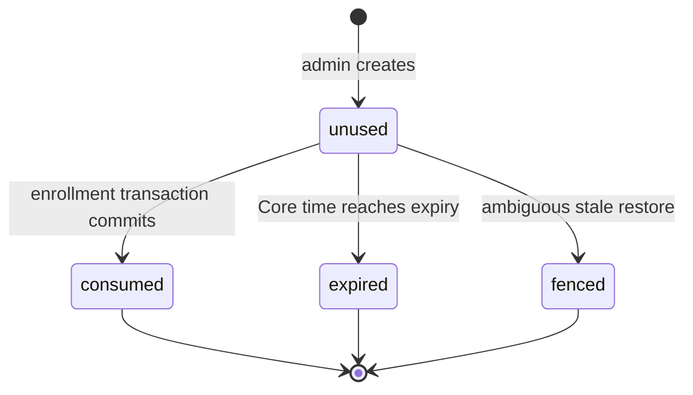
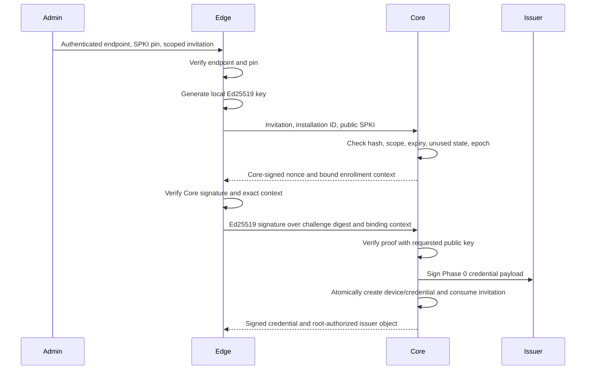

# Phase 0 device pairing and PKI bootstrap specification

| Field | Value |
|---|---|
| Status | Normative lifecycle reference; implementation has advanced beyond the original model |
| Scope | Canvas Core and Linux Canvas Edge identity bootstrap/lifecycle model only |
| Executable model | `tests/pki/pki-state-machine.ts` |
| Test command | `npx tsx --test tests/pki/*.test.ts` |
| Last reviewed | 2026-07-31 |
| Platforms | Linux `amd64` and Linux `arm64`; Android remains frozen and out of scope |

## 1. Authority and intent

This specification concretizes:

- P-003, P-012, and P-013 in `docs/adr/0004-device-identity-pki-and-mtls.md`;
- the current ownership and transport boundaries in `docs/CURRENT_ARCHITECTURE.md`; and
- `INV-02`, `INV-09`, `INV-16`, `DF-02`, `DF-13`, `PKI-01` through `PKI-08`, and `BAK-03` in `docs/PHASE_0_THREAT_MODEL.md`.

The executable harness validates state transitions and cryptographic bindings before production Core, Agent, proxy, or PKI code exists. It does not alter or bridge the legacy `/ws` boundary.

## 2. Critical model boundary: this is not X.509 or mTLS

> **The Phase 0 harness issues a signed JSON credential model. It does not issue, parse, or validate an X.509 certificate and it does not perform a TLS or mTLS handshake. It must not be deployed as a substitute for production device PKI.**

The harness uses real Ed25519 signatures and SHA-256 digests to exercise ownership and lifecycle rules. Its credential has the explicit format `canvas-phase0-signed-device-credential-v1` so code cannot silently mistake it for a certificate.

Production must replace the modeled artifacts as follows:

| Phase 0 model | Production requirement |
|---|---|
| Root-signed issuer authorization object | Offline root CA signs a constrained online issuing intermediate certificate |
| Signed JSON device credential | X.509 client certificate with immutable device ID in reviewed SAN/subject metadata |
| Enrollment request plus signed challenge proof | Reviewed PKCS#10 CSR or equivalent enrollment protocol with Ed25519 proof of possession |
| Connection challenge signed by the device key | TLS 1.3 client authentication and handshake proof of private-key possession |
| Core endpoint Ed25519 SPKI and challenge signature | Server-authenticated TLS using public Web PKI or a separately authenticated CA/SPKI pin |
| In-process registry validation | Reverse proxy verifies chain; protected proxy-to-Gateway channel forwards verified certificate data; Gateway independently checks serial, device lifecycle, revocation, and clone policy |
| In-memory issuer overlap | Real trust-bundle deployment, overlap, intermediate retirement/revocation, and rollback runbook |

A Core-signed application challenge in the harness adds deterministic context binding. It does not replace server-authenticated TLS. Likewise, a short invitation is authorization to enroll after Core authentication; it is never server identity proof.

## 3. Cryptographic profile used by the harness

- Edge device keys: Ed25519, generated inside `EdgeInstallation` after Core trust succeeds.
- Online issuer keys: Ed25519, generated inside the Core issuer boundary.
- Offline root key: separate Ed25519 key held by `OfflineRootAuthority` and used only to authorize issuer public keys.
- Core bootstrap identity: separate Ed25519 key whose SPKI SHA-256 pin is transferred in the authenticated bootstrap.
- Hashes and binding digests: SHA-256 with distinct domain-separation labels.
- Invitations: 256 random bits by default; the implementation rejects configurations below 128 bits.
- Owner recovery grants: 256 random bits by default, minimum 128 bits, maximum 15-minute TTL, one-use, and hash-only at rest.
- Signatures: Node 20 `node:crypto` Ed25519 signatures over canonical, key-sorted JSON and a domain-separation prefix.
- Test entropy: tests inject a deterministic SHA-256-derived source for repeatable invitation/nonces/IDs. It is explicitly test-only. Default harness entropy uses `crypto.randomBytes`. Ed25519 keys use `generateKeyPairSync('ed25519')`.

No private Edge key appears in an enrollment request, credential, Core registry snapshot, audit event, or database backup. The adversarial helper `simulateStolenCredentialCloneForTest` is intentionally named and exists only to inject the key-theft threat into tests.

## 4. Trust bootstrap and invitation

An authenticated admin transfer gives Edge a `PairingBootstrap` containing:

- the exact canonical HTTPS enrollment endpoint;
- the expected Core SPKI SHA-256 pin;
- a one-use invitation secret;
- site/group scope;
- expiry; and
- the current security epoch.

The transfer channel must authenticate the bootstrap. A QR code is a transport representation, not authentication by itself. If an attacker can replace both endpoint and pin in an unauthenticated bootstrap, pinning cannot identify the intended Core.

Edge performs these operations in order:

1. Require the `canvas-phase0-pairing-bootstrap-v1` format.
2. Require an exact HTTPS endpoint match with no userinfo, query, or fragment.
3. derive the presented Core SPKI pin and compare it with the bootstrap pin.
4. Validate invitation encoding, claimed entropy, scope, and local expiry.
5. Only then generate the local Ed25519 key and make an enrollment request available for transport.

Core stores only a domain-separated SHA-256 hash of the invitation secret. The record also stores a non-secret ID, entropy count, scope, creation/expiry, security epoch, and lifecycle status. Plain invitation secrets are absent from `Phase0PkiCore.inspect()` and audit records.

Invitation states are:

Wrong-scope, malformed, unknown, expired, consumed, and fenced invitations fail closed.

## 5. Enrollment and proof of possession

The signed challenge binds:

- exact Core endpoint;
- random nonce and challenge ID;
- invitation hash and scope;
- stable installation ID;
- requested Ed25519 public SPKI and fingerprint;
- security epoch; and
- challenge expiry.

The Edge proof signs a digest of the complete signed challenge plus installation, key fingerprint, and security epoch. Core accepts the proof only with the public key named in that challenge. A changed challenge, changed key, changed context, bad signature, stale epoch, expired challenge, or replay fails without issuance.

### 5.1 Atomic invitation consumption

Many contenders may obtain challenges while an invitation is still unused. Finalization is the serialization point. In one no-await transaction, Core:

1. rechecks invitation status, expiry, scope, and security epoch;
2. rechecks the challenge and Edge signature;
3. creates one immutable device ID;
4. creates one credential registry record;
5. marks the invitation consumed; and
6. invalidates all other outstanding challenges for that invitation.

The executable race starts 32 contenders before finalization and requires exactly one winner, one device, and one credential.

## 6. Phase 0 signed credential and identity binding

The signed credential payload contains:

- explicit non-X.509 format marker;
- random serial;
- immutable Core-assigned device ID;
- stable Edge installation ID;
- Ed25519 public SPKI and fingerprint;
- a digest binding device ID, installation ID, key fingerprint, security epoch, and generation;
- root-authorized issuer ID and authorization digest;
- security epoch;
- key generation and previous serial; and
- issuance and expiry times.

The online issuer signs every field. Core additionally requires the presented credential bytes/digest to match its serial registry. An attacker cannot change installation, key, device, epoch, issuer, or validity without invalidating the binding or signature.

Device identity is the registry identity bound to the authenticated credential. An observed runtime/transport instance is clone-detection input only; it is not a principal and cannot replace certificate-derived identity in production.

## 7. Connection, clone detection, quarantine, and revocation

The harness models connection-time private-key possession with a Core-signed nonce that binds serial, device, installation, credential digest, connection ID, observed runtime-instance signal, and security epoch. Edge signs the resulting proof with its current key.

Core validates, in order:

1. root authorization and issuer signature;
2. current security epoch and validity interval;
3. issuer active/overlap policy;
4. exact credential serial and registry digest;
5. device-to-installation binding and device lifecycle; and
6. targeted revocation/credential lifecycle.

One control session per credential is expected. A handover carrying the same observed runtime-instance value replaces the old session. Concurrent use of one serial from a different observed runtime instance causes a fail-closed transition:

- mark the device `quarantined`;
- mark that credential `quarantined`;
- close the original and attempted sessions;
- reject future authentication; and
- emit `credential_clone_quarantined` audit evidence.

This policy detects the modeled concurrent clone case. The observed signal is not hardware attestation; production must define reliable signals, NAT/reconnect behavior, false-positive handling, operator release, and alerting.

Targeted device revocation marks only that device and its serials revoked, closes only its live sessions, and blocks reconnect. Other devices and sessions remain active.

## 8. Device key rotation

Normal rotation occurs before expiry over an existing authenticated session:

1. Edge generates a new local Ed25519 key.
2. Core creates a signed rotation challenge bound to session, immutable device/installation, current serial/key, new public key, and security epoch.
3. Edge signs the same proof context with both the current private key and the new private key.
4. Core verifies current-key authorization and new-key proof of possession.
5. Core issues generation `n + 1` for the same device and installation.
6. Core marks generation `n` superseded/revoked, records `previousSerial`, and closes the old-key session.
7. Edge installs the new credential/key and reconnects.

A reused key, changed context, ended session, old-key authorization failure, or new-key proof failure aborts rotation. Rotation under a newly active issuer produces a credential from that issuer.

Expired credentials are not accepted for connection or normal rotation, even if Edge still holds the old private key or a formerly valid session ID. Recovery uses the separate owner-authorized flow below; an expired credential and old invitation are never implicit recovery proof.

## 9. Owner-authorized expired-credential and lost-key recovery

Recovery is a separate bootstrap state machine, not a weakened form of mTLS authentication or normal key rotation. It supports an Edge that was offline past credential expiry and an Edge installation that has lost its local key.

### 9.1 Owner recovery grant

Only a trusted Core administration boundary may call `createOwnerAuthorizedRecoveryGrant`. The harness requires an authenticated principal with role `owner`, successful step-up verification, and a stable authorization ID. Production user authentication, RBAC, step-up, and audit durability remain separate control-plane responsibilities.

The owner must select:

- the exact existing immutable device ID;
- the exact installation ID already bound to that device;
- `preserveDeviceId: true`; and
- a TTL no greater than 15 minutes.

Core creates a 256-bit secret by default and rejects configurations below 128 bits. The grant is one-use, security-epoch-bound, and short-lived. Core stores only a domain-separated SHA-256 hash plus non-secret target, owner authorization reference, expiry, preservation decision, and lifecycle fields. The clear secret appears only in the transfer artifact.

A grant without explicit `preserveDeviceId: true` cannot perform identity-preserving recovery. A grant for a different device or installation cannot be retargeted. Revoked and quarantined devices require a separate owner release decision before recovery.

### 9.2 Fresh-key proof and recovery transaction

The recovering Edge authenticates the exact Core endpoint/SPKI from the grant before generating or releasing recovery data. It then:

1. generates a new local Ed25519 key, without requiring the old private key;
2. sends the grant secret, exact device/installation/preservation fields, and new public SPKI;
3. verifies a Core-signed challenge binding the grant hash, target, current serial, next generation, new key, security epoch, nonce, and expiry; and
4. signs the complete challenge context with the new private key.

Core rejects a public key already used by any prior credential for that device. Finalization is the atomic serialization point. Core rechecks grant state/expiry/target/epoch, device generation/current serial, explicit preservation, and new-key proof, then in one transaction:

1. consumes the recovery grant;
2. invalidates every other pending challenge for that grant;
3. issues generation `n + 1` for the same device ID and installation ID;
4. records the previous current serial;
5. fences and revokes every prior credential for that device, not only the last serial;
6. closes every session for that device; and
7. activates only the newly issued credential.

Concurrent contenders may obtain challenges, but exactly one completion wins. A used grant, replayed proof, stale challenge, wrong grant, wrong device, wrong installation, changed generation, reused key, or invalid signature fails closed. Recovery is targeted: credentials, lifecycle, and sessions for every other device remain unchanged.

## 10. Issuer rotation and overlap

The offline root and online issuer are distinct key objects. Core generates a pending online issuer key and exposes only its public signing request to the offline root. Core activates an issuer only when:

- the root signature is valid;
- issuer ID, public key, validity, and request digest match Core's pending key; and
- Core still holds that pending protected private key.

On rotation:

- new issuance switches immediately to the new active issuer;
- the previous issuer enters `overlap` until the configured deadline, bounded by its root authorization validity;
- credentials from both issuers authenticate during overlap;
- after overlap, the previous issuer becomes unacceptable and its sessions are closed by lifecycle enforcement; and
- zero overlap retires the old issuer immediately.

The model does not reuse the device-PKI root for public TLS, release signing, or data encryption.

## 11. Stale database restore and monotonic security fencing

This specification chooses the fail-closed security-epoch option permitted by architecture section 10.4, `PKI-07`, and `BAK-03`, rather than attempting to recover exact revocation state from a restored database alone.

`MonotonicSecurityFence` is independently durable from the modeled Core database and holds:

- a monotonically increasing security-mutation sequence; and
- a monotonically increasing minimum security epoch.

Every invitation, owner recovery grant, issuance, recovery, rotation, revocation, quarantine, and issuer activation advances the fence and then checkpoints its sequence in the database. On restore:

- a database checkpoint ahead of the independent fence is an inconsistency and fails hard;
- an exact checkpoint/epoch match is not ambiguous;
- an older checkpoint or epoch is an ambiguous stale restore.

For an ambiguous restore, Core atomically:

1. advances the independent security epoch;
2. invalidates all restored invitations and owner recovery grants, including records that appear unused;
3. fences all restored credentials, including records whose revocation rows may have disappeared;
4. moves restored devices to `recovery_required`;
5. retires restored issuers and clears the active issuer;
6. clears all sessions and enrollment, rotation, connection, and recovery challenges; and
7. blocks invitation, recovery-grant, and credential issuance until the offline root authorizes a new issuer.

Credentials, invitations, and owner recovery grants carry their issuance epoch. Material from any previous epoch is rejected even if stale database rows claim it is active. Repeating an old restore advances the epoch again; it can never lower the fence.

This strategy intentionally sacrifices availability and may require explicit fleet recovery after an ambiguous restore. It is preferable to silently resurrecting a consumed invitation or revoked credential.

## 12. State-machine summary

| Object | Allowed transitions |
|---|---|
| Invitation | `unused -> consumed`, `unused -> expired`, `unused -> fenced` |
| Owner recovery grant | `unused -> consumed`, `unused -> expired`, `unused -> fenced`; target and preservation decision are immutable |
| Device | `active -> quarantined`, `active -> revoked`, `active -> recovery_required` after stale restore; owner recovery returns an eligible target to `active` without changing its ID |
| Credential | `active -> superseded` on normal key rotation, `active -> revoked`, `active -> quarantined`; owner recovery moves all prior serials `-> fenced`; any restored credential `-> fenced` |
| Issuer | `active -> overlap -> retired`, or `active -> retired` with zero overlap |
| Session | `challenge -> active -> closed`; clone quarantine, rotation, revocation, expiry, issuer retirement, and restore close matching sessions |
| Security epoch | strictly monotonic; only ambiguous restore advances it in this model |

## 13. Executable validation matrix

| Test | Primary requirements covered |
|---|---|
| `Edge authenticates the pinned Core...` | `PKI-01`, `TM-PKI-01`; trust before key generation/data release; 128-bit minimum; hash-only persistence |
| `signed challenge and Ed25519 proof...` | `PKI-03`, `TM-PKI-04`; signed challenge, proof mismatch/replay, installation/key binding, explicit non-X.509 format |
| `concurrent invitation consumption...` | `PKI-02`, `TM-PKI-02`; 32-way race with exactly one transaction winner |
| `expired, wrong-scope, and malformed invitations...` | `PKI-02`, `TM-PKI-03`; typed fail-closed invitation rejection |
| `concurrent cloned-credential use...` | `PKI-05`, `TM-PKI-05`; quarantine, active close, reconnect denial, audit |
| `authenticated key rotation...` | normal-rotation portion of `PKI-06` and `TM-PKI-06`; current/new dual proof and superseded-key rejection |
| `expired credential cannot connect or rotate...` | expiry/lost-key portion of `PKI-06` and `TM-PKI-06`; expired denial, fresh-key recovery, preserved identity, prior fencing, unaffected peer |
| `owner recovery grants are high-entropy...` | owner/step-up requirement, ≥128-bit hash-only grant, ≤15-minute TTL, exact device/installation binding, explicit preservation, expiry and replay denial |
| `concurrent lost-key recovery has one winner...` | atomic one-use recovery transaction, one winner, all prior serials fenced, immutable device/installation identity |
| `targeted revocation...` | `PKI-05`, `TM-PKI-07`; active disconnect and unaffected peer |
| `issuer rotation accepts...overlap` | `PKI-08`; root authorization, new issuance, bounded overlap, retirement |
| `stale database restore advances...` | `INV-16`, `PKI-07`, `BAK-03`, `TM-PKI-08`; pre-consume/pre-revoke restore, issuer recovery, repeated monotonic fencing |

The tests use a controlled clock and deterministic non-key entropy. Assertions depend on invariants rather than scheduling, wall-clock timing, or generated key bytes.

## 14. Known production gaps and follow-up gates

The requested Phase 0 state-machine behaviors are executable, but this artifact deliberately does not claim the following production controls:

1. **Real X.509/mTLS:** no certificate profiles, SAN encoding, PKCS#10 parsing, TLS handshake, reverse-proxy configuration, trusted forwarded-header channel, CRL/OCSP behavior, or Gateway listener isolation is implemented.
2. **Durable transaction backend:** invitation and owner-recovery races run through synchronous in-memory commits, not PostgreSQL row locking/unique constraints across processes or replicas.
3. **Durable fence backend:** the production location, write protocol, backup policy, quorum/TPM/HSM option, and failure behavior for the independent monotonic fence remain to be selected and disaster-tested.
4. **Private-key storage boundary:** no Rust Agent account, `0600` file, TPM, renderer/WebView denial, filesystem backup, crash-dump, or support-bundle forensic test is present.
5. **Production owner-recovery control plane:** expiry and lost-key recovery are executable, but the harness accepts an already trusted owner/step-up context. Real session authentication, owner-only RBAC, CSRF/origin controls, confirmation UX, physical/out-of-band transfer, authorization expiry, and durable audit enforcement are not implemented.
6. **Clone signal quality:** the harness injects an observed runtime-instance signal. Production needs a reviewed concurrent-session policy and operational handling without treating IP address or client payload as identity.
7. **Abuse resistance:** endpoint rate limits, derived human display codes, brute-force accounting, invitation attempt lockout, network flood behavior, and audit export/alert delivery are not modeled.
8. **Issuer operations:** HSM/KMS custody, offline-root ceremony, intermediate constraints, compromise/revocation distribution, backup recovery, clock uncertainty, and multi-process trust-bundle rollout need real runbooks and drills.
9. **Additional recovery/release procedures:** quarantine release, revoked-device reactivation policy, issuer compromise, root rotation, device replacement/decommission, and recovery-grant delivery UX are outside this isolated harness.

These gaps must be closed by production PKI, proxy/Gateway, Agent storage, and operational recovery work before a production Edge is enrolled.
