# Phase 0 Threat Model — Canvas Core, Intelligence, and Edge

| Field | Value |
|---|---|
| Status | **Security baseline; open work is tracked in `docs/ROADMAP.md`** |
| Architecture status | Reference threat model; current code and deployment require periodic re-review |
| Last reviewed | 2026-07-31 |
| Active targets | Linux PC `amd64` and Raspberry Pi `arm64` |
| Authoritative sources | `docs/CURRENT_ARCHITECTURE.md`, runtime contracts, and accepted ADRs under `docs/adr/` |
| Method | STRIDE, data-flow and trust-boundary analysis, abuse cases, and risk-ranked validation |

This document turns the approved Canvas Core/Intelligence/Edge architecture into an actionable security model for Phase 0. It covers the target architecture, the coexistence period, and the authority migration from today's per-display Fastify/SQLite system. It is a design and validation baseline, not a claim that the target controls are already implemented.

Normative terms such as **must**, **must not**, and **required** describe security gates. If a prototype disproves an accepted design, the decision must be amended through a reviewed superseding ADR before dependent production work proceeds.

## 1. Non-negotiable scope statements

1. **Android is frozen and out of scope.** No Android migration, security refactor, build, test, release, or support claim is authorized by this threat model. Android receives no credentials or new Core/Edge protocol work. Re-enabling Android requires a separately approved plan and threat review.
2. **No credentials.** This document and all Phase 0 fixtures, examples, logs, captures, simulators, regression corpora, and support bundles must contain no live credentials. In the target runtime, no shared, user, Home Assistant, MQTT, media-provider, model-provider, admin, or release-signing credential may be stored on or injected into Edge, the renderer, a WebView, the Content Bridge, a scene manifest, a URL, or a referrer. The only secret identity material required on Edge is that Edge's own locally generated, non-exported per-device private key; its certificate is not secret. This narrow exception does not authorize a fleet-wide shared secret.
3. **Legacy `/ws` remains separate.** The existing `/ws` endpoint is a legacy coexistence protocol. It is not Device Protocol v1, must not be silently redefined as v1, and must not be routed into the new trust boundary as a compatibility shortcut. Protocol v1 uses the separate `/device/v1/control` boundary. Legacy clients remain explicitly labeled, isolated, measured, and removable only after deprecation and recovery gates pass.
4. **No production behavior is removed in Phase 0.** The full Linux sidecar, Hermes, current media behavior, and legacy paths remain until their replacements and rollback gates pass.
5. **The LAN is hostile.** Private addressing, loopback-adjacent deployment, Home Assistant ingress, or physical proximity does not authenticate a user, device, browser, MQTT publisher, or local process.
6. **User and device identity are independent.** Admin sessions never substitute for device mTLS, and a device certificate authenticates a display—not the human speaking near it.

## 2. Authority, scope, and review triggers

### 2.1 Binding decisions

This model inherits the accepted decisions in:

- `docs/adr/0001-core-intelligence-edge-boundaries.md`
- `docs/adr/0002-authoritative-data-and-storage.md`
- `docs/adr/0003-native-rust-edge-agent.md`
- `docs/adr/0004-device-identity-pki-and-mtls.md`
- `docs/adr/0005-device-protocol-v1.md`
- `docs/adr/0006-voice-and-intelligence-boundary.md`
- `docs/adr/0007-media-and-content-bridge.md`
- `docs/adr/0008-deployment-updates-and-platforms.md`

The current delivery gates are in `docs/ROADMAP.md`. Where this document is more specific, it
defines a security requirement but does not override an accepted ADR or executable contract.

### 2.2 In scope

- Core browser administration, owner bootstrap, API, roles, sessions, and audit.
- Reverse-proxy separation of admin and device ingress.
- Device Gateway, Protocol v1, desired/reported state, commands, replay, and availability.
- Pairing bootstrap, private device PKI, mTLS, rotation, revocation, clone handling, and restore.
- Edge Agent, renderer, WebViews, Unix IPC, Content Bridge, hardware helpers, and updater.
- Home Assistant, MQTT, media/model providers, and other external integrations.
- Canvas Intelligence, typed tools, model output, memory, and Hermes coexistence.
- Wake word, microphone transport, ASR/TTS, voice authorization, privacy, and retention.
- Scene/content acquisition, direct media, official YouTube playback, and callbacks.
- Core and Edge updates, signing, provenance, health gates, and rollback.
- Legacy import, authority modes/epochs, write fencing, rollback reconciliation, and retirement.
- PostgreSQL, object storage, Edge SQLite, backups, logs, audit, and support bundles.

### 2.3 Explicit non-goals and assumptions

- This is not a multi-tenant or multi-region cloud threat model.
- Initial Core is one Docker Compose deployment; high availability is not claimed.
- Home Assistant remains authoritative for HA entities, integrations, and automations.
- Edge remains useful offline, but new HA actions, AI requests, media discovery, editing, and fleet updates may be unavailable.
- Host root compromise or unrestricted physical disk access can defeat software-only Edge protections. TPM, measured boot, secure boot, and hardware-backed keys may reduce that risk later but are not Phase 0 guarantees.
- A compromised Core owner can intentionally perform owner-authorized actions and may tamper with locally retained audit data. Independent audit export is future hardening, not a current guarantee.
- At-least-once delivery is intentional. Canvas does not promise universal exactly-once physical or external effects.

### 2.4 Mandatory review triggers

Re-run and amend this model before:

- changing device identity, mTLS termination, PKI hierarchy, or bootstrap trust;
- adding a protocol version, command kind, execution class, or new privileged IPC method;
- adding remote model/media providers or a model-visible tool family;
- enabling raw HA panels or any Edge credential exception;
- changing Content Bridge origin, port, CSP, referrer, or callback behavior;
- changing update signing, updater privilege, migration compatibility, or rollback rules;
- adding a new platform, including Android;
- enabling multiple Core/Gateway replicas or external object storage;
- changing voice pre-roll, retention, debug capture, or remote-provider policy;
- accepting a critical/high risk as residual rather than mitigating it.

## 3. Security objectives and invariants

| ID | Invariant |
|---|---|
| INV-01 | Only an authenticated, authorized human or scoped service principal can mutate Core state. |
| INV-02 | Device identity is derived from a validated certificate and active registry record, never from JSON, query parameters, caller headers, IP address, or MQTT topic text. |
| INV-03 | Edge initiates outbound control connectivity; no inbound LAN control port is required by the target design. |
| INV-04 | Admin and device ingress use separate authentication, authorization, rate-limit, and routing policies. |
| INV-05 | Core commits authoritative mutations and outbox intent transactionally before acknowledgement. Edge commits receipts/results and cursors before acknowledgement. |
| INV-06 | A duplicate cannot execute an unrelated action: stable IDs, canonical digests, execution classes, expiry, and durable receipts are mandatory. |
| INV-07 | A non-repeatable crash window becomes `unknown_outcome`; it is never automatically retried or reported as success. |
| INV-08 | Core owns desired state; Edge owns applied/observed state. Every authority change has a new epoch, and there is no dual-write authority mode. |
| INV-09 | Renderer/WebView compromise does not disclose the device private key, grant unrestricted IPC, install updates, or issue arbitrary hardware commands. |
| INV-10 | Model and retrieved content are untrusted data. Only deterministic policy and typed, scoped tools can cause effects. There is no model-accessible shell, raw SQL, arbitrary URL fetch, or unrestricted HA call. |
| INV-11 | No microphone bytes leave Edge before a validated wake/PTT trigger. Only the approved bounded wake pre-roll may be included after trigger; PTT has no pre-press audio by default. |
| INV-12 | Raw audio is not retained by default in Core, inference services, temporary files, logs, backups, support bundles, or remote providers. |
| INV-13 | Scene/assets are staged and hash-verified before activation; invalid content never replaces current or previous known-good content. |
| INV-14 | YouTube uses official Data API v3 and IFrame Player APIs. Canvas does not scrape, extract, download, proxy, cache, or transcode YouTube streams. |
| INV-15 | The running Core cannot forge an Edge release. Release private signing keys are offline/isolated, and Edge independently verifies signed metadata and artifacts. |
| INV-16 | Restore cannot make consumed invitations usable, erase revocation meaning, reuse ambiguous stream/authority epochs, or silently activate scenes with missing objects. |
| INV-17 | Logs, audit, telemetry, URLs, referrers, and support bundles do not disclose credentials, private keys, or raw audio. |
| INV-18 | Inference, worker, or media-provider failure cannot disconnect the Device Gateway, break HA connectivity, blank displays, or stop already-running media. |
| INV-19 | Current and previous protocol/data versions interoperate through the declared rolling-upgrade window. |
| INV-20 | Legacy `/ws` and Protocol v1 remain separate until legacy retirement; no unauthenticated central compatibility endpoint is introduced. |

## 4. Risk method

### 4.1 Rating

| Rating | Meaning | Required disposition |
|---|---|---|
| Critical | Fleet-wide compromise, signing/CA compromise, broad credential theft, unsafe unauthenticated control, or unrecoverable fleet/data loss is plausible. | Must have a named owner and blocking mitigation/test before the dependent phase. Cannot be silently accepted. |
| High | One-device compromise, sensitive HA action, privacy breach, durable split-brain, or remote kiosk loss is plausible. | Must be mitigated before the feature's phase exit, with an automated or repeatable test. |
| Medium | Bounded disclosure, degradation, abuse requiring meaningful access, or recoverable operational failure. | Mitigate or explicitly accept with owner, monitoring, and revisit date. |
| Low | Limited impact and difficult exploitation with existing controls. | Track and harden when practical. |

Likelihood assumes an untrusted LAN, internet-derived WebView/model content, ordinary device loss, and accidental operator error. It does not assume that attackers already control Core host root, Edge host root, the offline CA root, or the release signing key; those are impact scenarios and residual risks.

### 4.2 Priority labels

- **P0:** required for Phase 0 exit or before any production identity/transport implementation depends on it.
- **P1:** required before the named later phase can exit or before canary use of the feature.
- **P2:** defense-in-depth or operational hardening before fleet-wide cutover.

## 5. System and actor model

```mermaid
flowchart TB
    Admin[Owner, admin, operator, viewer]
    Services[Scoped service identities]
    HA[Home Assistant]
    MQTT[MQTT broker and publishers]
    Providers[Media and model providers]
    Backup[Backup and recovery operator]

    subgraph CoreHost[Canvas Core host]
        Proxy[Reverse proxy]
        AdminAPI[Admin API and UI]
        Gateway[Device Gateway]
        Registry[Device registry and PKI issuer]
        State[State, command, and action journals]
        Intelligence[Canvas Intelligence and tool policy]
        Worker[Worker]
        DB[(PostgreSQL)]
        Objects[(Content-addressed objects)]
        Inference[Isolated ASR, TTS, and LLM]
        Audit[Audit, metrics, and support]
    end

    subgraph EdgeHost[Canvas Edge]
        Agent[Native Rust Edge Agent]
        EdgeDB[(Edge SQLite and verified cache)]
        Renderer[Unprivileged Tauri renderer]
        WebViews[Remote and local WebViews]
        Bridge[Loopback Content Bridge]
        Voice[Wake, mic, speaker, audio focus]
        Player[YouTube IFrame and local players]
        Hardware[Hardware adapters]
        Updater[Privileged updater and watchdog]
    end

    Legacy[Legacy Fastify sidecar, REST, MQTT, and /ws]
    Hermes[Hermes transitional adapter]

    Admin --> Proxy
    Services --> Proxy
    Proxy --> AdminAPI
    Proxy --> Gateway
    AdminAPI --> State
    Gateway --> State
    Registry --> DB
    State --> DB
    State --> Objects
    AdminAPI --> Intelligence
    Intelligence --> Inference
    Worker --> DB
    AdminAPI --> Audit
    Gateway --> Audit

    HA <--> AdminAPI
    MQTT --> AdminAPI
    Providers <--> AdminAPI
    Backup <--> DB
    Backup <--> Objects

    Agent <-->|mTLS WSS control| Gateway
    Agent <-->|Authenticated HTTPS content| Proxy
    Agent <-->|Post-wake authenticated voice WSS| Proxy
    Agent <--> EdgeDB
    Agent <-->|Peer-authenticated scoped IPC| Renderer
    Renderer --> WebViews
    Renderer --> Bridge
    Bridge --> Player
    Agent <--> Voice
    Agent <--> Player
    Agent <--> Hardware
    Agent -->|Signed allowlisted request| Updater

    Hermes -.->|Migration only| Intelligence
    Legacy -.->|Separate coexistence only| Renderer
```

### 5.1 Actors and principals

| Actor/principal | Trust and permitted authority | Must not be assumed |
|---|---|---|
| `owner` | Full installation administration, including security-sensitive recovery. | That an owner action is safe merely because it is authenticated; confirmations and audit still apply. |
| `admin` | Device, scene, integration, and policy administration according to role. | Release-signing or offline-root access. |
| `operator` | Day-to-day scene/device/media operations. | User/role, PKI, integration-secret, or fleet-release authority. |
| `viewer` | Read-only views explicitly authorized by policy. | Access to secrets, raw support bundles, or mutating tools. |
| Scoped service identity | Narrow API/integration scope with rotation and audit. | Human privileges or device identity. |
| Edge Agent | One certificate-bound device principal and local execution policy. | Admin identity, HA credential, or authority for another Edge. |
| Renderer | Unprivileged presentation process. Treat as compromise-prone. | Device key, durable command authority, updater access, or arbitrary hardware authority. |
| WebView content | Untrusted even when selected by an admin; may be internet-controlled later. | Access to local stores, IPC, credentials, broad navigation, or callback trust. |
| Updater/helper | Narrow privileged local principal for verified install/rollback operations. | General shell, arbitrary package, or unsigned Core instruction authority. |
| Home Assistant | External authoritative entity/integration system. Its data and responses remain untrusted input to Canvas policy. | Canvas user identity, safe retry semantics, or permission to bypass action journals. |
| MQTT publisher/broker | External ingress. Broker authentication is not Canvas authorization. | Direct Edge command authority or permission to bypass Core journal/policy. |
| Model/inference provider | Untrusted computation over intentionally shared inputs. | Tool authority, direct Edge/HA access, trustworthy output, or acceptable retention by default. |
| Media/content provider | Untrusted metadata and bytes subject to validation and policy. | Safe URLs, stable behavior, or authority over local callbacks. |
| Hermes | Transitional executor/adapter. | System-of-record status or fallback authority after a mutation may have started. |
| Local kiosk user | Can touch/interact with the display according to local policy. | Admin identity or authorization for sensitive voice/HA/fleet actions. |
| LAN/internet attacker | Can scan, connect, replay, flood, host content, and influence external data. | Any trust from address, topology, or origin alone. |
| Compromised Edge | Holds only one device identity and cached, filtered data. | Fleet secrets, HA token, or ability to impersonate another Edge. |
| Host root/physical attacker | Outside the initial software-only protection guarantee. | That compromise is undetectable or should remain fleet-wide; revocation and recovery still apply. |

## 6. Assets

| ID | Asset | Primary owner/location | Security need and impact |
|---|---|---|---|
| A-01 | Offline device-PKI root and protected issuing intermediate | Offline custody / Core issuer | **C/I critical.** Theft or misuse can impersonate fleet devices; loss can prevent rotation/recovery. |
| A-02 | Release signing private key and public trust root | Isolated signing workflow / Edge trust store | **I/A critical.** Compromise enables malicious fleet packages; loss blocks trusted releases. |
| A-03 | Envelope-encryption master key and integration secrets | External secret mechanism / Core | **C/I critical.** Exposure grants HA/provider access; loss can make encrypted data unavailable. |
| A-04 | Edge private key and certificate lifecycle | Edge Agent storage / Core registry metadata | **C/I high.** Key theft impersonates one Edge; certificate metadata/revocation must remain monotonic. |
| A-05 | User identities, password/verifier data, sessions, API tokens, roles | Core/PostgreSQL | **C/I high.** Theft or tampering grants control-plane authority. Store token/verifier hashes, not plaintext tokens. |
| A-06 | Desired state, authority epochs, commands, action journal, results, uncertainty | Core/PostgreSQL; durable Edge receipts | **I/A critical.** Tampering or loss can cause unsafe action, split-brain, duplicate effects, or false success. |
| A-07 | Reported/applied state and capabilities | Edge observation; Core journal | **I/A high.** Forgery hides divergence or misdirects fleet actions. |
| A-08 | Scenes, manifests, assets, allowed origins, assignments | Core objects/PostgreSQL; verified Edge cache | **C/I/A high.** Private content can leak; hostile/corrupt content can compromise renderer or blank displays. |
| A-09 | HA state, token, service permissions, camera URLs/images | HA via encrypted Core integration | **C/I high.** Exposure reveals home state or permits physical/security actions. |
| A-10 | MQTT credentials, messages, and topic ACLs | Core integration / broker | **C/I medium-high.** Spoofing can create unauthorized commands or disclose state. |
| A-11 | Model/media API keys and provider configuration | Core secret store | **C/I high.** Exposure creates data, cost, and account abuse. |
| A-12 | Microphone audio, transcripts, conversations, memories, speaker identity inferences | Edge memory; controlled Core storage | **C high.** Privacy and household surveillance impact. |
| A-13 | Tool schemas, policy, confirmations, action digests, effective principals | Core Intelligence | **I critical.** Tampering converts untrusted model output into unauthorized effects. |
| A-14 | Edge SQLite, outbox, command receipts, known-good content, update state | Edge Agent storage | **I/A high.** Corruption can replay work, lose results, or prevent offline recovery. |
| A-15 | Core PostgreSQL, object storage, backups, migration maps/watermarks | Core/backup destination | **C/I/A critical.** Loss or stale restore can erase authority and security history. |
| A-16 | Update manifests, packages, rollback authorization, migration compatibility | Signing pipeline/Core distribution/Edge cache | **I/A critical.** Tampering or incompatibility can compromise or brick displays. |
| A-17 | Audit events, logs, metrics, traces, support bundles | Core and bounded Edge storage | **C/I/A high.** They support investigation but can leak secrets/audio or be forged/erased. |
| A-18 | Gateway, renderer, hardware, media, and voice availability | Core/Edge | **A high.** Outage can blank kiosks, interrupt accessibility, or require physical repair. |

## 7. Trust boundaries

| ID | Boundary | Why it is a boundary | Required control summary |
|---|---|---|---|
| TB-01 | Admin browser/service → public reverse proxy | Untrusted network and browser content meet privileged APIs. | TLS, secure owner bootstrap/session design, RBAC, CSRF/origin controls as applicable, limits, audit. |
| TB-02 | Edge → dedicated device hostname/reverse proxy | LAN clients can spoof payloads and flood handshakes. | Server-authenticated TLS, client certificate validation, device-specific limits. |
| TB-03 | Reverse proxy → internal Device Gateway | Forwarded certificate identity can be spoofed if the channel/listener is exposed. | Strip inbound identity headers, protected internal channel, proxy allowlist, Gateway serial/status/revocation checks. |
| TB-04 | Core modules → PostgreSQL/object/secret storage | Application compromise or confused service boundaries can bypass ownership. | Least-privilege service access, transactions, envelope encryption, immutable object/revision rules. |
| TB-05 | Core → HA/MQTT/media/model providers | External systems can return hostile data, time out after effects, retain data, or be SSRF targets. | Typed adapters, egress policy, timeouts, schemas, action journal, retention contract, no automatic uncertain retry. |
| TB-06 | Core orchestrator → inference containers | Models are untrusted and GPU services are failure-prone. | No device sockets/integration credentials, restricted network, typed output validation, resource isolation/circuit breakers. |
| TB-07 | Agent → Core control/content/voice planes | Remote commands, content, and audio have different sensitivity/availability needs. | mTLS/authenticated sessions, independent bounded planes, schema/hash verification, backpressure. |
| TB-08 | Edge Agent → renderer/hardware/media/voice adapters | Renderer and local processes may be compromised. | Unix peer credentials, filesystem ownership, method capabilities, process/session binding, least privilege. |
| TB-09 | Renderer → remote WebViews | Scene/admin-selected content may become malicious or be navigated cross-origin. | Navigation/origin allowlists, sandboxing, strict capability separation, no stores/keys/IPC by default. |
| TB-10 | WebView → loopback Content Bridge | Loopback is reachable by hostile local processes and browser-origin attacks. | Bind `127.0.0.1` only; validate Host/origin/method/body; short-lived renderer-session capability; strict CSP/CORS/referrer. |
| TB-11 | Agent → privileged updater/helper | This crosses into package install/reboot/root-equivalent operations. | Peer-authenticated allowlist, replay protection, independent signature/metadata verification, power-loss journal. |
| TB-12 | Core/Edge → logs/support/backup destinations | Operational exports can silently become bulk exfiltration paths. | Redaction, authorization, encryption, short-lived upload URLs, integrity, retention, tested restore. |
| TB-13 | Legacy sidecar, REST, MQTT, `/ws` → coexistence environment | Current paths do not meet target identity/durability controls. | Network containment, explicit labels, no bridge into v1 trust, telemetry, write fencing, timed retirement. |
| TB-14 | Legacy databases/files → migration importer/Core authority | Imported data may be conflicting, corrupt, hostile, stale, or credential-bearing. | Canonical source selection, neutral schema, validation, staging report, secret re-entry/rotation, epochs/watermarks. |

## 8. Data flows

| ID | Flow | Sensitive data/effect | Required protections and safe failure |
|---|---|---|---|
| DF-01 | Admin browser → proxy → Admin API | Sessions, roles, scenes, commands, integrations, updates | Authenticate and authorize every operation; concurrency checks; CSRF/origin policy; audit actor/target/correlation; fail closed if PostgreSQL cannot commit. |
| DF-02 | Admin → pairing invitation → Edge → issuer | Bootstrap endpoint/pin, invitation secret, CSR, certificate | Authenticate Core first; invitation ≥128 bits, hashed, short-lived, scoped, one-use/atomic; local Ed25519 key; proof of possession; no private-key transfer. |
| DF-03 | Edge → proxy/Gateway control WSS | Hello, capabilities, desired/reported state, commands/results | mTLS-derived principal; Protocol v1 schema/runtime validation; epochs/sequences/ACKs; durable inbox/outbox; size/depth/rate limits. |
| DF-04 | Edge → HTTPS content plane | Scene manifests, assets, update metadata, support upload | Short-lived authorization, HTTPS, content length/type limits, hash/signature checks as applicable, staging and atomic activation. |
| DF-05 | Edge → separate voice WSS → ASR/Intelligence/TTS | Post-trigger Opus, transcript, response audio | Authenticated device/session, indicator before send, bounded pre-roll, quotas/timeouts, no default raw-audio retention, session close stops frames. |
| DF-06 | Core ↔ Home Assistant | Encrypted token, entity state, service calls, camera data | Credential only in Core; least HA permissions; filtered subscriptions; typed allowlisted calls; confirmation; timeout may be `unknown_outcome`. |
| DF-07 | MQTT → Core integration → action/state journal | External events and requested actions | Broker transport/ACL plus Canvas schema/authz; stable actor/action ID; dedupe/expiry/rate limit; never direct to Edge. |
| DF-08 | Intelligence → model/inference adapter | Sanitized prompts, context, transcript, model output | Minimize data; provider policy; no secrets; restricted egress; output remains untrusted; deterministic policy/tool validation before effects. |
| DF-09 | Agent ↔ renderer/adapters over local IPC | Scene activation, interactions, hardware/media/voice methods | Peer credential and method capability checks; bounded schema; no arbitrary path/URL/shell; audit privileged requests. |
| DF-10 | Renderer → Content Bridge → official YouTube IFrame | Wrapper assets, player session capability, callbacks | Exact loopback origin, Host/origin checks, strict CSP/referrer, validated `postMessage`, actual player-state result, no YouTube byte proxy. |
| DF-11 | Signing workflow → Core metadata → updater → package manager | Signed manifest, `.deb`, rollback authorization, DB migration | Offline/isolated key; immutable artifact/hash; arch/protocol/schema checks; anti-downgrade; local health; cached compatible rollback. |
| DF-12 | Core/Edge → logs/support bundle → authorized operator | Config metadata, versions, health, recent logs | Structured redaction, bounded capture, explicit authorization/audit, short-lived upload URL; exclude keys/tokens/raw audio. |
| DF-13 | PostgreSQL/objects/PKI continuity → backup → restore | Authoritative data, encrypted secrets, issuer continuity | Encrypt and integrity-protect; separate offline keys; restore order/validation; preserve revocation/invitation monotonicity; change ambiguous epochs. |
| DF-14 | Legacy export → staging importer → Core | Pages/settings/assets/device placeholders/local preferences | Consistent backup, versioned neutral format, schema/content validation, conflict report, no plaintext secret copying, idempotent import and watermark. |
| DF-15 | Legacy `/ws` → legacy renderer during coexistence | Caller-declared identity and optimistic commands | Keep separate from `/device/v1/control`; contain network; mark unauthenticated/legacy; never use it as proof of device identity or v1 delivery. |

## 9. Current legacy exposure

The following is a repository inspection of current behavior, not a statement about the target design. It explains why coexistence must be contained and why the old sidecar cannot be treated as the new Edge Agent.

| ID | Current evidence | Exposure | Rating | Required disposition |
|---|---|---|---|---|
| LEG-01 | `server/src/config.ts` defaults to `HOST=0.0.0.0`, port `3100`, wildcard CORS, and development JWT/admin defaults. `browser/linux/src-tauri/src/lib.rs` explicitly spawns the sidecar with `HOST=0.0.0.0`. | The full API, admin assets, logs, media/voice routes, and socket are LAN reachable by default. Wildcard CORS expands browser-origin access. | Critical | Until retirement, isolate with host firewall/VLAN/reverse proxy and never expose port 3100 to the internet or an untrusted LAN. Do not mistake JWT plugin registration for enforcement. |
| LEG-02 | `server/src/index.ts` registers JWT but applies no global authentication/authorization hook to the inspected routes; mutating routes are registered directly under `/api`. | Reachable callers can read/mutate settings, pages/devices, issue display/audio/HA actions, invoke voice/Hermes functions, or read logs. | Critical | Contain immediately. Target Admin API requires explicit session/RBAC checks per operation; no unauthenticated central compatibility API may be introduced. |
| LEG-03 | `server/src/ws/index.ts` accepts `/ws`, then trusts `hello.client_type` and caller-selected `device_id`; `device_status` can also replace the effective ID. | Device/editor spoofing, duplicate identity, false online/offline state, message observation, and command misdelivery. No durable replay/expiry/result lifecycle exists. | Critical | Keep `/ws` explicitly legacy and separate. Protocol v1 derives identity only from mTLS and uses durable journals at `/device/v1/control`. |
| LEG-04 | `server/src/routes/ha.ts` exposes all HA states, camera proxy, and arbitrary domain/service forwarding using the Supervisor token, without an application authz layer. | A LAN caller may disclose household state/cameras or cause HA effects with add-on authority. | Critical | Restrict current reachability. Target uses a centrally encrypted, least-privilege HA credential and typed allowlisted calls with principal policy and confirmation. |
| LEG-05 | `browser/linux/src/store/config.ts` persists an HA long-lived token in Tauri plugin-store. `KioskScreen.tsx` sends it to HA and injects it into HA-origin `localStorage`. | Edge loss, renderer/WebView compromise, local store access, logs/dumps, or malicious HA-origin content can expose a high-value bearer credential. | Critical | This is a known legacy exception and blocks the target credential gate. Prefer Canvas-native scenes; do not invent another persistent token injection scheme. Rotate the token after suspected Edge compromise. |
| LEG-06 | `server/src/db/index.ts` and `server/src/routes/settings.ts` store MQTT, Hermes, Whisper, and YouTube secrets in legacy SQLite; API output masks selected keys but storage is plaintext. | Sidecar/database/backup compromise discloses shared credentials. Masking output is not encryption or authorization. | High | Inventory without printing values; re-enter or rotate into Core encrypted secret storage during migration. Do not copy uncertain plaintext secrets. |
| LEG-07 | `server/src/mqtt/index.ts` subscribes to direct command topics and broadcasts or calls local REST handlers outside a durable Core action journal. | Broker/topic compromise, retained messages, duplicate delivery, and competing command paths can bypass policy, ordering, idempotency, and audit. | High | Disable if unused and enforce broker ACLs while legacy remains. Target MQTT terminates at Core and enters the same action/command journal. |
| LEG-08 | `browser/linux/src-tauri/capabilities/remote.json` permits all `http://*/*` and `https://*/*` remote WebViews and grants `store:default`; page/command URLs can create or navigate external WebViews. | Malicious or compromised content may access exposed Tauri capabilities, probe local state, navigate unexpectedly, or combine with unauthenticated commands. | Critical | Target remote WebViews receive no store, key, updater, shell, or broad IPC capability. Freeze exact origin/navigation policy and add hostile-WebView tests before real Agent IPC. |
| LEG-09 | `browser/linux/src-tauri/capabilities/default.json` includes shell execute/open for local windows; `lib.rs` exposes hardware/navigation commands and has an optional safe mode that disables the WebKit sandbox. | Renderer compromise can increase local impact; sandbox-off mode materially weakens isolation. | High | Native Agent/helper methods must be narrowly typed and peer/method authorized. Treat sandbox-off mode as an explicit degraded-risk exception, never a production security control. |
| LEG-10 | `server/src/routes/commands.ts` accepts a caller-provided URL for panel navigation. `KioskScreen.tsx` loads page/floating URLs into external WebViews. | Unauthenticated remote navigation can display phishing/hostile content and exercise the broad remote-WebView boundary. | Critical | Operationally contain legacy ingress. Target scenes declare allowed origins; renderer validates navigation against policy and receives only scoped capabilities. |
| LEG-11 | `server/src/routes/hermes.ts` and `server/src/routes/voice.ts` accept caller-selected Hermes, Canvas, Whisper, and Piper URLs/tokens. `server/src/services/hermes.ts` disables TLS certificate verification for Hermes WSS and tries token-bearing query-string fallbacks. | SSRF, credential forwarding/leakage through URLs/logs/proxies, interception, and unauthenticated AI-triggered display effects. | Critical | Do not expose these routes. Target provider endpoints are admin-configured, allowlisted, TLS-validated adapters; secrets never enter request bodies/URLs from untrusted callers. Hermes shadow has no mutating credentials. |
| LEG-12 | `server/src/routes/voice.ts` exposes unauthenticated transcription, TTS, microphone test, and full voice-turn routes; the sidecar also owns wake/mic/audio processes. | Remote microphone activation/testing, compute abuse, audio disclosure, and duplicated local voice authority are possible if reachable. | High | Contain current listener. Target mic capture stays in Agent/voice runtime and transmission starts only after policy-valid wake/PTT. Sensitive diagnostics require admin policy and audit. |
| LEG-13 | Current YouTube wrapper is served by the full sidecar. It validates video IDs and playback context but has no target Content Bridge capability/Host/origin boundary or strict CSP, and the listener is LAN bound. | Local/LAN callback forgery and a larger-than-needed origin/server attack surface remain; sidecar removal could also reintroduce error 153. | High | Keep behavior until the isolated bridge prototype passes. Target bridge is loopback-only, capability-bound, strict-CSP, Host/origin/method limited, and contains no fleet API or secrets. |
| LEG-14 | `server/src/logs.ts` captures arbitrary `console.*` arguments without structured redaction, and `server/src/routes/logs.ts` exposes history/live SSE on the same unauthenticated API. | Tokens, URLs, prompts, errors, or personal data can be captured and read remotely; live streams enable reconnaissance and resource use. | High | Restrict legacy access. Target redacts at source, authorizes bundle/log access, bounds local storage, and never includes keys/tokens/raw audio. |
| LEG-15 | `release.sh` builds and publishes `.deb` artifacts but does not itself create/verify the approved signed release manifest, independent trust root, anti-downgrade counter, canary health gate, or automatic rollback journal. | A compromised release path or bad package can be distributed without the target recovery guarantees. | Critical for fleet update | Do not call the legacy release path a secure fleet updater. Signed/update/rollback design and drills gate fleet rollout and sidecar removal. |
| LEG-16 | Each current server owns an independent SQLite database and global/singleton settings/state. | Conflicting sources, stale timestamps, blind merge, and split-brain are likely during centralization. | High | Select one canonical source, import idempotently into staging, use explicit authority modes/epochs, and never dual-write. |

### 9.1 Immediate coexistence containment

These are operational safeguards, not substitutes for the target architecture:

- Block direct inbound access to sidecar port 3100 except explicitly required legacy peers; prefer host firewall and a dedicated management network.
- Never forward legacy `/ws` or unauthenticated `/api` to the public internet.
- Disable MQTT, Hermes, voice diagnostics, and remote media search where unused; apply broker/network ACLs where retained.
- Treat every current Linux display that stores an HA token as a credential-bearing endpoint. Revoke/rotate after loss, reimage, support capture, or suspected compromise.
- Do not place new credentials in query strings, page URLs, scene data, logs, screenshots, test fixtures, or issue reports.
- Inventory legacy access and emit telemetry by path/client version so retirement can prove zero use; telemetry is not authentication.
- Preserve current behavior and rollback paths while containment is applied. Do not silently repurpose `/ws` as Protocol v1.

## 10. STRIDE coverage summary

| Boundary/domain | Spoofing | Tampering | Repudiation | Information disclosure | Denial of service | Elevation of privilege |
|---|---|---|---|---|---|---|
| Core admin | Session/owner impersonation | Scene, role, policy, update changes | Actor denies mutation | Session/integration data leak | Login/API/upload flood | Broken RBAC/IDOR |
| Device Gateway | Device/proxy-header spoof | Command/state replay or schema abuse | False device result | Fleet metadata leak | Connection/message flood | Device acts for another device |
| Pairing/PKI | Rogue Core, stolen invitation, cloned cert | CSR/cert/revocation manipulation | Untracked pair/revoke | Device key/CA leakage | Enrollment/rotation exhaustion | Unauthorized device enrollment |
| Local Edge/IPC | Local process impersonates renderer/Agent | Cache, IPC, callback, update state | Unattributed local action | Key/token/content leakage | Socket/disk/renderer exhaustion | WebView reaches hardware/updater/root |
| HA/MQTT | Publisher/service identity spoof | Event/action modification or replay | Missing source/action journal | HA state/token/camera leakage | State/topic floods | Unrestricted HA service authority |
| Intelligence/models | Model/provider identity confusion | Prompt, context, memory, tool arguments | Model/tool decision not reconstructable | Prompt/transcript/secret exfiltration | Token/GPU/tool loop exhaustion | Prompt injection invokes privileged tool |
| Voice | Wake/human identity spoof | Audio/session frame injection | Speaker disputes action | Pre-trigger/raw audio/transcript leak | Wake flood/provider stall | Room principal performs user action |
| Content/YouTube | Forged player/bridge callback | Scene/asset/wrapper modification | False playback success | Private asset/capability/referrer leak | Large asset/player callback flood | Web content invokes local privilege |
| Updates | Signer/Core/updater impersonation | Package/manifest/migration tamper | Untracked override/rollback | Signing or deployment secret leak | Bricked/crash-loop fleet | Malicious package gains host privilege |
| Migration/backup | Source/restore operator spoof | Authority epoch/data/revocation rollback | Unrecorded conflict decision | Secrets/backups leak | Restore/cutover outage | Legacy regains write authority |
| Logs/support | Actor/device field spoof | Log/audit deletion/injection | Missing correlation/nonrepudiation | Secret/audio/config disclosure | Disk/SSE/upload exhaustion | Bundle access bypasses normal policy |

## 11. Detailed threats and required controls

### 11.1 Core administration and Device Gateway

| ID | STRIDE | Threat and impact | Required controls | Verification/gate |
|---|---|---|---|---|
| ADM-01 | S/E | First remote visitor claims initial owner. | Owner claim is loopback/console-only or uses a high-entropy, expiring, one-use out-of-band secret; atomically consume it, rate-limit it, audit it, and disable the endpoint after owner creation. | Concurrent/race and remote-first-visitor tests before Phase 2. |
| ADM-02 | S/I | Session theft, fixation, default secret, cross-origin request, or token in browser storage grants admin access. | Freeze session design in Phase 0. Use strong password/verifier handling, rotation/logout/revocation, secure cookie attributes and CSRF defenses if cookie-authenticated, strict CORS/origin policy, no default production secrets, and step-up/confirmation for sensitive operations. | Auth matrix, session replay/revocation, CSRF/CORS, and secret-scanning tests. |
| ADM-03 | E | Broken RBAC/IDOR lets a viewer/operator mutate devices, integrations, PKI, bundles, or releases. | Server-side role/scope checks on every API and Intelligence tool; object/target authorization after group expansion; deny by default; sensitive operations require stronger policy. | Route/tool authorization matrix for `owner`, `admin`, `operator`, `viewer`, and service identities. |
| ADM-04 | T/R | Concurrent edits, hidden group expansion, or mutable history makes it impossible to prove what changed. | Optimistic concurrency; immutable scene revisions/commands/audit; snapshot target sets; stable actor/action/correlation IDs; append audit before reporting success. | Competing update and group-membership race tests. |
| ADM-05 | D | Login, query, upload, support-bundle, or expensive report floods starve Gateway. | Separate admin/device policies; body/depth/time/row limits; endpoint-specific rate limits and quotas; background jobs for expensive work; worker failure cannot own Gateway availability. | Load test admin abuse while 100 simulated Edges maintain heartbeat/commands. |
| GW-01 | S/E | Client supplies proxy identity headers or reaches internal Gateway directly. | Dedicated device hostname; proxy strips all client identity headers; only proxy reaches internal listener over protected channel; Gateway independently validates certificate serial, device status, revocation, and clone policy. | Direct-Gateway and forged-header tests must fail closed. |
| GW-02 | S | Payload `device_id`, query string, source IP, or old `/ws` identity changes principal. | Ignore payload identity for authorization; derive immutable device ID from certificate SAN/registry; mismatch is protocol error/audit. Keep `/ws` separate. | Send valid messages containing another device ID and prove no principal/target change. |
| GW-03 | T/R | Replay, reordering, ACK loss, reused idempotency key, or crash repeats effects or fabricates success. | Runtime schema/semantic validation; message/command IDs; stream epoch/sequence; canonical digest; expiry; durable inbox/outbox/receipts; schema-fixed execution classes; explicit `unknown_outcome`. | Protocol conformance and every pre/post-side-effect crash-window test. |
| GW-04 | T | Stale desired/reported state or restored cursors regress current authority. | Authority/stream epochs, monotonic revisions, desired digest, contiguous ACK cursor, explicit reset after truncation/restore, per-domain application status. | Delay/reorder/restore simulator tests and stale digest conflict rejection. |
| GW-05 | D | Handshake/reconnect/message flood consumes CPU, memory, DB, or queues. | mTLS before application session, reconnect/pairing limits, bounded connections and pending messages per device, max payload/schema depth, backpressure, priority queues, stale non-reader disconnect. | Flood and slow-reader tests; critical results remain durable under pressure. |
| GW-06 | I | Admin responses or device messages disclose other devices' state, content URLs, or support data. | Principal-scoped queries, short-lived content URLs, no secret fields in ordinary APIs, minimal filtered state, structured redaction. | Cross-device access and URL-expiry tests. |
| GW-07 | D/T | PostgreSQL outage leaves socket memory acting as authority. | Fail closed for mutations that cannot persist; do not ACK durable work before commit; reconstruct pending work from PostgreSQL after restart. | Kill/restart Core and PostgreSQL around each commit/ACK boundary. |

### 11.2 Pairing, device identity, and PKI

| ID | STRIDE | Threat and impact | Required controls | Verification/gate |
|---|---|---|---|---|
| PKI-01 | S | Edge pairs to a rogue Core through a malicious QR, DNS response, or short code. | Bootstrap carries canonical HTTPS endpoint plus trusted Web PKI identity or independently authenticated CA/SPKI pin. A short code alone is insufficient unless server trust already validates. | Rogue bootstrap/MITM/DNS tests before enrollment code exists in production. |
| PKI-02 | S/E/D | Invitation is guessed, stolen, raced, replayed, or brute-forced. | ≥128 bits randomness; display code only as rate-limited derived representation; Core stores hash; short expiry; group/site scope; atomic one-use consumption; admin audit; optional physical confirmation. | High-concurrency consume test has exactly one winner; brute/rate/expiry tests fail closed. |
| PKI-03 | S/T | Attacker submits another key, replays a CSR, or Core generates/receives the private key. | Edge generates Ed25519 key locally; proof-of-possession CSR binds requested identity/context; private key never leaves Edge; certificate binds immutable device ID. | CSR signature/key mismatch/replay tests; packet/log scan shows no private key. |
| PKI-04 | S/I | Renderer, WebView, local user, backup, or support bundle extracts device key. | Dedicated Agent account/storage, root-owned mode `0600` minimum, OS/hardware-backed storage when available, no renderer/store API, never export through Canvas. | Renderer/local-process/bundle forensic test cannot read key. |
| PKI-05 | S | Cloned certificate creates two active installations or a revoked device remains connected. | Gateway checks serial and lifecycle independently; detect concurrent clone use; quarantine/reject and audit; revocation closes active sessions and blocks reconnect; revoking one device does not affect others. | Clone from two simulated installations; targeted live revocation/disconnect. |
| PKI-06 | D/E | Expired long-offline device is recovered by weakening normal authentication or silently creating a duplicate. | Define explicit admin-authorized expiry recovery/re-pair procedure; preserve device identity mapping where approved; never accept expired cert or invitation as implicit proof. | Normal rotation, offline-past-expiry, lost-key, and duplicate-device tests. |
| PKI-07 | T/E | Restoring old database resurrects consumed invitations or removes revocations. | Choose and document an independently durable security journal/CRL source or fail-closed issuer/security-epoch rotation after ambiguous restore; invalidate ambiguous invitations/certs. | Restore from backup predating consume/revoke and prove old material remains unusable. |
| PKI-08 | E | Online issuer or offline root compromise enables fleet impersonation. | Offline root, constrained/protected issuing intermediate, separate duties/storage, rotation/overlap/revocation runbooks, minimal issuer API, audited issuance. | Issuer rotation and disaster drill; root/release/data keys remain distinct. |

### 11.3 Edge Agent, IPC, renderer, and WebViews

| ID | STRIDE | Threat and impact | Required controls | Verification/gate |
|---|---|---|---|---|
| EDGE-01 | S/E | Any local process connects to an Agent socket because it knows the path. | Unix socket ownership/mode plus peer credential validation; map executable/service identity where feasible; method-level capabilities; default deny. Socket path is never authorization. | Wrong UID/GID/process and copied-socket-path tests. |
| EDGE-02 | E/T | Renderer reuses/stakes a capability, invokes updater/key/filesystem/shell methods, or sends malformed requests. | Short-lived process/session-bound capabilities; nonce/replay protection where needed; strict generated schemas and limits; no key/updater/shell/arbitrary path methods; revoke on renderer restart. | Stale/replayed token, renderer restart, fuzz, and forbidden-method tests. |
| EDGE-03 | E/I | Hostile remote WebView accesses Tauri store, device state, IPC, or HA token. | Remote content gets no store/plugin/native capabilities by default; exact origin/navigation allowlist; separate WebView contexts; sandbox/CSP; no device or integration credential in renderer memory. | Hostile page on allowed and disallowed origins cannot invoke store, Agent, hardware, updater, or key operations. |
| EDGE-04 | T/E | Admin/model/legacy command navigates a trusted WebView to attacker content while retaining privileges. | Bind capabilities to process/session and exact origin, re-evaluate on every navigation/redirect, close/recreate on trust change, validate scene-declared origins. | Cross-origin redirect, `window.open`, custom scheme, and navigation-race tests. |
| EDGE-05 | E | Main Agent runs as root or a generic helper accepts arbitrary commands. | Agent runs unprivileged; narrow root helper/updater accepts only typed allowlisted operations from peer-verified Agent; fixed executable/arguments; no general shell. | Attempt arbitrary package/path/argument/command injection. |
| EDGE-06 | T/D | Edge SQLite/cache corruption replays commands, loses results, or replaces known-good content. | WAL/busy timeout; migration backup; integrity check after unclean shutdown; durable receipt before result; known-good current/previous content protection; visible safe recovery. | Corruption, full disk, unclean shutdown, and migration interruption tests. |
| EDGE-07 | D | Renderer crash loop blanks display or causes Agent disconnect. | Agent independently supervises renderer; restart current known-good; roll back repeated crash loops; Agent/control connection remains healthy and reports incident. | Kill/crash renderer repeatedly with Core online/offline. |
| EDGE-08 | I/T | Logs or crash dumps expose URLs, init scripts, tokens, audio, or keys. | Structured redaction before logging; avoid full command/config dumps; bounded root-owned logs; support-dump allowlist; no secrets/raw audio. | Seed canary secrets and inspect logs, `/tmp`, coredump policy, and bundle output. |
| EDGE-09 | E | WebKit sandbox is disabled to work around graphics failures. | Production support matrix must run with sandbox enabled. Any sandbox-off mode is an explicit local maintenance exception with warning, no secrets, no privileged WebViews, and no claim of normal security. | Runtime configuration assertion and hostile-WebView test in supported PC/Pi matrix. |

### 11.4 Content Bridge and local HTTP origin

| ID | STRIDE | Threat and impact | Required controls | Verification/gate |
|---|---|---|---|---|
| CB-01 | S/E | DNS rebinding, malicious Host header, LAN bind, or local process reaches bridge endpoints. | Bind only `127.0.0.1`/explicit IPv6 decision; validate exact Host and reserved port; no wildcard interfaces; short-lived renderer-session capability; local process is still untrusted. | Socket inspection plus hostile Host, DNS-rebinding, LAN, and unrelated-local-process tests. |
| CB-02 | S/T | Forged player callback or `postMessage` reports false playback or changes session. | Validate source window, exact origin, event schema, session capability/ID, current candidate, state transition, and expiry. Success requires actual Edge player state. | Forged/stale/cross-session callback and source/origin tests. |
| CB-03 | I | Capability, API key, video/session secret, or private URL leaks through query, referrer, browser history, logs, or page content. | No long-lived secrets in bridge; capability in protected channel/header or non-referrer-leaking mechanism; strict `Referrer-Policy`; redact access logs; short expiry and session binding. | Network/referrer/history/log capture proves no credential/capability leakage. |
| CB-04 | T/E | Wrapper or injected script escapes intended domains. | Bundled immutable wrapper; strict CSP limited to required YouTube origins; no inline/dynamic code unless hash/nonce design is reviewed; no admin/API/HA/MQTT/voice routes. | CSP violation, script injection, disallowed connect/frame/navigation tests. |
| CB-05 | D | Oversized body, connection flood, callback storm, or slow client exhausts Edge. | GET/POST allowlist, content type/body/time/concurrency limits, no directory listing, bounded logging/rate limits. | Local HTTP fuzz/flood while renderer and Agent remain healthy. |

### 11.5 Home Assistant and MQTT

| ID | STRIDE | Threat and impact | Required controls | Verification/gate |
|---|---|---|---|---|
| HA-01 | I | HA bearer/refresh token reaches Edge files, SQLite, environment, logs, backups, memory intended for support, or WebView storage. | Store encrypted only in Core; send filtered entity data and typed actions, never token. Prefer Canvas-native scenes. Raw HA panel exception blocks the no-credential gate. | Forensic token scan required before Phase 4 exit. |
| HA-02 | E | Generic service-call proxy lets user, device, model, or MQTT invoke sensitive HA services. | Least-privilege HA identity; typed allowlisted service tools; validate target/data schemas; effective user/device/room scope; confirmation for locks, alarms, purchases, credential/security actions. | Authorization/confirmation matrix with dangerous service corpus. |
| HA-03 | T/R | HA call times out after succeeding and Canvas retries, causing duplicate physical action. | Stable Core action/idempotency ID; operation execution class; inspect post-state where valid; otherwise record `unknown_outcome`; never auto-retry uncertain mutation or fall back executor. | Inject timeout before/after HA acceptance and verify journal/result. |
| HA-04 | D/I | Full-state subscription or malicious attributes flood fleet or disclose unnecessary data. | Subscribe only for active scenes/tools/admin needs; normalize, filter, size-limit, coalesce before sequence; per-device authorization; never relay arbitrary attributes blindly. | State/attribute flood and cross-scene data minimization tests. |
| HA-05 | S/T | Compromised HA sends false state or malicious text/URLs used by renderer/model. | HA is authoritative for entity state but its values remain untrusted for HTML, URL fetch, prompts, and policy; escape/validate at every sink; show source/provenance. | Stored-XSS, prompt-injection, oversized attribute, and hostile URL fixtures. |
| MQTT-01 | S/E | Any broker publisher issues a Canvas command or claims an actor/device by topic. | Authenticated/TLS broker connection for production where supported, narrow topic ACLs, mapped scoped service identity, payload schema, Canvas authorization. Topic/device text is non-authoritative. | Unauthorized publisher/topic and spoofed actor/device tests. |
| MQTT-02 | T/R | Retained/duplicate/reordered MQTT messages bypass command expiry or execute twice. | MQTT ingress terminates at Core, receives stable action ID/digest/expiry, enters the same durable state/action journal, and follows execution-class rules. No direct Edge subscription. | Retained replay/duplicate/reorder test yields one journaled logical action/result. |
| MQTT-03 | D | Topic storm starves HA/Gateway/PostgreSQL. | Per-identity/topic rates, payload limits, bounded queues, coalescing for state, reject/dead-letter visibility; prioritize device results and desired state. | Broker flood while control SLO and critical persistence hold. |

### 11.6 Canvas Intelligence, models, tools, and Hermes

| ID | STRIDE | Threat and impact | Required controls | Verification/gate |
|---|---|---|---|---|
| AI-01 | T/E | Direct or indirect prompt injection from transcript, HA attribute, scene, media result, or provider output invokes a privileged tool. | Treat all text as data; deterministic routing for known intents; capability-scoped typed tools; policy after planning; no shell/raw SQL/arbitrary fetch/unrestricted HA tool; output-schema validation. | Prompt-injection corpus across every untrusted source; zero unauthorized effects. |
| AI-02 | E | Model chooses a tool outside effective user/device/room/integration scopes. | Tool declares stable version, schemas, scopes, read/mutate class, confirmation, idempotency, timeout, redaction, and capability checks. Core authorizes the effective principal independently of model claims. | Generated and hand-crafted invalid tool calls fail closed. |
| AI-03 | S/T | Confirmation for one action is reused after target/arguments change. | Bind confirmation to conversation, effective principal, normalized action digest, exact target, tool version, and short expiry; any change invalidates it. | Mutation-after-confirmation and replay tests. |
| AI-04 | T/R | Timeout or fallback between native Intelligence and Hermes executes a mutation twice. | One shared action ID/journal; fallback only before execution begins; after uncertain/timed-out mutation reconcile or ask user—never invoke another executor. | Fail each transition boundary and prove at most one attempted executor after side-effect start. |
| AI-05 | I | Prompt/context sends credentials, unrelated HA state, private memory, or raw audio to a local/remote provider. | Data minimization and sensitivity labels; provider allowlist/retention contract; no secrets; explicit remote-provider policy; per-user/conversation scope; redacted traces. | Canary-secret and cross-user/context isolation tests; provider request capture. |
| AI-06 | T/I | Memory poisoning, cross-user retrieval, or permanent transcript conversion changes future actions or leaks history. | Memory item source, owner/scope, sensitivity, creation, retention, deletion, and provenance; explicit opt-in for durable preferences; do not silently persist all transcripts. | Cross-principal retrieval, deletion/export, poisoned-memory provenance tests. |
| AI-07 | E | Compromised inference container reaches Device Gateway, HA, secret storage, or unrestricted internet. | Private network, no device sockets or integration credentials, restricted egress, read-only/minimal filesystem, resource quotas; Core validates every output. | Network-policy tests from each inference container. |
| AI-08 | D | Adversarial input causes unbounded model/tool loops, GPU starvation, cost, or control-plane impact. | Turn/tool/token/time/cost limits, loop detection, per-principal quotas, circuit breakers, separate resources, deterministic degraded mode when LLM unavailable. | Tool-loop/token-bomb/provider-failure tests while Gateway/HA remain healthy. |
| AI-09 | E/I | Hermes shadow receives credentials or can mutate production. | Shadow only sanitized input, no mutating credentials, no execution capability; compare structured outcomes. Hermes remains transitional, not authoritative. | Network/secret scan and attempted shadow mutation prove no effect. |
| AI-10 | R | Tool/model decision cannot be reconstructed without logging sensitive chain-of-thought. | Record input source IDs, effective principal, route/planner/tool versions, policy result, confirmation digest, typed args/result summary, action ID, and redactions. Do not require hidden reasoning retention. | Audit reconstruction test from request to final result without secrets/raw audio. |

### 11.7 Voice privacy and authorization

| ID | STRIDE | Threat and impact | Required controls | Verification/gate |
|---|---|---|---|---|
| VOICE-01 | I | Continuous or early microphone transmission violates privacy promise. | Wake/PTT validation remains local; listening indication activates before first frame; no bytes before trigger; wake pre-roll default 1 second, hard maximum 2 seconds after trigger; PTT zero pre-press by default. | Packet timing/content tests for wake, PTT, false wake, reject, mute, and session end. |
| VOICE-02 | I | Audio remains in files, logs, temp storage, inference cache, provider retention, backup, or bundle. | Memory-resident pre-roll where possible; discard rejected/aborted data; raw retention off everywhere by default; provider eligibility matches policy; debug capture is explicit, visible, expiring, and audited. | Filesystem/container/log/bundle/provider forensic scan after normal/error/crash turns. |
| VOICE-03 | S/E | Wake word or nearby speaker is treated as authenticated human and unlocks/purchases/administers. | Device certificate authenticates room/device only. Default voice principal is constrained; sensitive HA, purchase, credential, mic diagnostic, PKI, and fleet operations need authenticated user and/or stronger out-of-band confirmation. | Adversarial/replayed speech corpus cannot cross room-principal policy. |
| VOICE-04 | S/T | Attacker injects/replays voice frames or attaches to another device/session. | Separate authenticated voice WSS; short-lived session bound to mTLS device, conversation, limits, codec, and nonce/sequence; reject frames before acceptance/after close/across sessions. | Cross-device/session replay, reordered frame, and post-close frame tests. |
| VOICE-05 | D | Wake floods, long speech, provider stall, or malformed Opus consumes Core/GPU and leaves media ducked. | Duration/byte/rate/session limits; VAD timeout; independent ASR/TTS/LLM circuit breakers; restore audio focus/media on every terminal/error path; voice cannot block control plane. | Wake storm, malformed stream, provider crash/timeout, and barge-in tests. |
| VOICE-06 | I/R | Transcript/conversation retention is hidden or undeletable. | Visible configurable retention, off/short by default until configured; source/scope/sensitivity; deletion/export path; audit access and debug enablement. | Retention expiry, deletion/export, and admin visibility tests. |
| VOICE-07 | T | Model/provider response controls playback or tools without policy. | Transcript normalization and policy/tool checks occur before effects; TTS content is data; playback is a typed session; malformed TTS cannot become a local command/path. | Hostile transcript/TTS/provider response fixtures. |

### 11.8 Scenes, assets, media, and YouTube

| ID | STRIDE | Threat and impact | Required controls | Verification/gate |
|---|---|---|---|---|
| CNT-01 | T/E | Malicious/corrupt scene or asset executes script, navigates privileged origin, or replaces known-good display. | Immutable revisions; authenticated manifest acquisition; schema/capability/origin/size validation; content hashes; preload/readiness; atomic activation; retain previous known-good. | Corrupt/missing/oversized/hostile-origin scene never activates. |
| CNT-02 | E/I | Core or Edge fetches `file:`, loopback, link-local, private service, redirect target, or credential-bearing URL. | Scheme/host allowlist, DNS and resolved-IP validation on every redirect, prohibit URL userinfo, egress restrictions, size/time/content limits, no arbitrary model fetch. | SSRF corpus including DNS rebinding and redirect-to-private targets. |
| CNT-03 | I | Private image/camera/media credential is embedded in scene or permanent URL. | Short-lived scoped asset authorization; no permanent camera/provider credential in WebView; explicit camera brokering design; manifests contain references, not secrets. | URL expiry, referrer/log capture, and WebView storage scan. |
| MEDIA-01 | T/R | Core reports media success when it only opened a WebView or accepts forged callback. | Edge/player observation is authoritative; correlate session/candidate/capability; success only after required player state; typed errors and fallback. | Forged callback stays unsuccessful; actual playing state is required. |
| YT-01 | T/Policy | Canvas scrapes/extracts/proxies/caches/transcodes YouTube or leaks API key to Edge. | Data API v3 only for Core metadata; official IFrame Player on Edge; direct YouTube bytes; API key stays encrypted in Core; enforce policy in design/review/tests. | Network trace shows no Canvas media-byte relay/extractor and no key on Edge. |
| YT-02 | D | Error 153 or eligibility errors are misclassified, causing loops or broken playback. | Exact supported origin/non-empty referrer; error 153 is configuration failure, not candidate failure; runtime errors 100/101/150 may use approved next candidate; bounded retries. | Actual playback on `amd64` and Bookworm `arm64`, including error-code behavior. |
| MEDIA-02 | D | Core restart stops active direct media or reconnect emits an unintended stop. | Edge owns active playback state; preserve enough state to report truth; reconnect reconciles without default stop; new discovery may fail offline. | Restart Core/Gateway during playback and verify continuity/result. |

### 11.9 Updates, signing, supply chain, and rollback

| ID | STRIDE | Threat and impact | Required controls | Verification/gate |
|---|---|---|---|---|
| UPD-01 | S/T/E | Attacker or compromised Core substitutes package/manifest. | Offline/isolated release signing key; signed manifest with artifact SHA-256, size, version, arch/platform, protocol/schema ranges, migration/rollback flags; Edge verifies independently. | Bit flip, substituted URL/package, fake Core metadata, and unknown signer fail before install. |
| UPD-02 | T | Downgrade installs known-vulnerable release or unsigned rollback disables policy. | Monotonic security/version counter; anti-downgrade; explicit signed rollback authorization limited to compatible known-good target; trust-root rotation/revocation procedure. | Downgrade/replayed manifest/expired rollback authorization tests. |
| UPD-03 | D | Wrong architecture, glibc, dependency, disk, protocol, or DB schema bricks Edge. | Native architecture builds; Bookworm glibc ≤2.36; preflight platform/arch/disk/dependencies/protocol/schema; cache prior package/dependencies/data state. | Wrong-arch/incompatible-schema/low-disk/missing-dependency rejection on PC and Pi. |
| UPD-04 | D | Power loss or crash at any install/migration/boot-health stage leaves no runnable version. | Independent updater/watchdog; power-loss-safe journal; separate package or two-slot self-update; boot attempt counter; current/previous compatible state; resume or rollback. | Cut power/kill Agent/updater at every transition and recover without physical repair. |
| UPD-05 | E | Compromised Agent/renderer invokes arbitrary privileged updater operation. | Peer-authenticated, replay-protected, strict allowlist; updater independently verifies metadata/signature/hash/compatibility; no arbitrary path/package/shell. | Malicious IPC request cannot install local/unsigned package or replace trust root. |
| UPD-06 | D | Validly signed but defective release rolls across fleet. | Canary channels/groups, quantitative local health gate independent of Core reachability, failure thresholds, automatic pause, staged promotion, rollback-loop stop/recovery UI. | Inject canary crash/media/db failures; promotion pauses and affected Edge rolls back. |
| UPD-07 | T/R | Signing override, release promotion, or rollback is unaudited. | Separate roles/duties where practical; immutable manifest/digest; audit promotion/pause/override/rollback actor, reason, target, and result. | Release audit reconstruction and unauthorized promotion test. |
| UPD-08 | T/D | Core migration prevents rollback or creates mixed-version incompatibility. | Immutable image digests, SBOM/provenance, versioned Compose contract, expand/contract migrations, backup before migration, current/previous Edge compatibility, documented no-return point. | Roll forward/back within window with current and previous Edge; destructive contraction waits. |
| UPD-09 | T | Compromised dependency/build environment inserts malicious native binary. | Pinned/reviewed dependencies, native per-architecture build, isolated CI, provenance/SBOM, immutable artifacts, secret isolation, reproducibility comparison where practical. | Provenance verification, dependency audit, and artifact/source traceability gate. |

### 11.10 Migration authority and legacy retirement

| ID | STRIDE | Threat and impact | Required controls | Verification/gate |
|---|---|---|---|---|
| MIG-01 | S/T | Wrong SQLite source or “latest timestamp wins” overwrites intended configuration. | Administrator selects canonical shared source; inventory every DB; preserve IDs/mapping; display conflicts; clocks are not trusted ownership proof. | Import multiple conflicting fixtures and require explicit resolution. |
| MIG-02 | T/E | Legacy and Core both accept authoritative writes, producing split-brain. | Explicit per-domain `legacy`, `shadow`, `core`, or `rollback_pending`; exactly one writable authority; no dual-write; write-fence legacy when Core takes over. | Concurrent write attempts prove only active authority commits. |
| MIG-03 | S/T | Stale legacy/Edge snapshot overwrites Core after cutover or restore. | New `authority_epoch` on every cutover/rollback; final source watermark; full desired snapshot; reject lower/stale revisions and old epochs. | Delay old snapshots/messages across cutover and restore; all are rejected. |
| MIG-04 | T/R | Rollback makes stale SQLite writable and silently loses post-cutover edits. | Enter `rollback_pending` with neither side writable; export/reconcile or explicitly discard with operator approval; create new rollback epoch; retain audit/backups. | Full cutover, post-cutover edit, rollback reconciliation, and second idempotent cutover. |
| MIG-05 | I/E | Import copies plaintext secrets or hostile HTML/URLs/scripts into trusted Core. | Inventory secret presence without values; rotate/re-enter secrets; neutral versioned export; schema/content/origin validation; stage and report unsupported records. | Canary-secret scan and malicious legacy content/URL corpus. |
| MIG-06 | S | Imported device ID is treated as secure identity. | Import devices as unpaired placeholders; establish new identity only through authenticated pairing/CSR; explicit mapping after enrollment. | Imported ID cannot connect or authorize until paired. |
| MIG-07 | R | Authority transition lacks actor, counts, digests, watermark, or rollback deadline. | Record source/destination epochs, actor, time, final watermark, imported counts/digests, conflicts, backups, and deadline. | Migration report is sufficient to reconstruct and repeat transition. |
| MIG-08 | E | Legacy `/ws` or admin routes remain as a hidden bypass after Core authority. | Keep path separate, write-fence by authority mode, measure use, publish deprecation, retain recovery package, remove only after approved zero-use window and tests. | Attempt legacy mutation in `core` mode; it fails without entering v1 journal. |

### 11.11 Backups, restore, logs, audit, and support bundles

Canvas Routines add executable stored plans to this boundary. Treat routine definitions, learned
plans, trigger aliases, active revision pointers, execution history, and confirmation records as
security-relevant authoritative data.

| ID | STRIDE | Threat | Required control | Repeatable validation |
|---|---|---|---|---|
| ROUT-01 | T/E | AI or an editor injects an unregistered tool, broadens parameters, or changes ownership while presenting a harmless summary. | Strict schema, typed Tool Registry allowlist, Core-owned ownership/risk classification, immutable revisions, full preflight on every execution. | Generated/edited drafts with unknown tools, malformed parameters, broader roles, or missing targets fail simulation and cannot run. |
| ROUT-02 | S/T | Ambiguous voice, MQTT replay, webhook replay, or duplicate scheduler delivery executes the wrong plan more than once. | Exact normalized matching, ambiguity refusal, authenticated ingress, MQTT expiry/action ID, durable idempotency, schedule-local-time key. | Duplicate and ambiguous trigger suite proves zero or one execution as appropriate. |
| ROUT-03 | E/I | Learned plans retain secrets or silently compile elevated/failed/corrected behavior into a fast path. | Learning off/suggest/automatic-draft modes; secret/long-value removal; three stable successes; elevated, failed, ambiguous, and confirmation-required exclusion; disabled drafts. | Inspect stored learned JSON and attempt elevated/failed/secret-bearing compilation. |
| ROUT-04 | T/D | Enabled fast path becomes stale after entity removal, permission change, tool removal, or restore. | Revalidate active revision, tool, role, parameters, confirmation policy, and cached target on every hit; fall back to ordinary planning. | Remove each dependency in turn and prove no stale execution occurs. |
| ROUT-05 | E | A future code/AI step accesses Core secrets, filesystem, Docker socket, host mounts, or unrestricted network. | Phase 7 remains gated; separately deployed JSON-only sandbox with no Core secrets/socket/mounts and allowlisted authenticated RPC plus resource limits. | Architecture/container inspection and hostile sandbox suite before enabling any advanced step kind. |

| ID | STRIDE | Threat and impact | Required controls | Verification/gate |
|---|---|---|---|---|
| BAK-01 | I | Backup theft exposes database, assets, encrypted secrets, CA continuity, or private content. | Encrypt in transit/at rest; least-privilege backup identity; destination off primary disk; separate access/retention; master/issuer continuity material protected; offline root and release private keys backed up separately. | Unauthorized restore/read test and inventory of backup contents/permissions. |
| BAK-02 | T/D | Database restores without matching objects or keys; published scenes become corrupt/unavailable. | Consistent staged publication; preserve hashes/manifests; reachability plus GC grace; documented restore order; reject published revisions with missing/mismatched objects. | Restore DB/object snapshots with intentionally missing/corrupt objects and fail safe. |
| BAK-03 | S/E | Restore resurrects invitations/revoked certs or reuses ambiguous epochs/cursors. | Monotonic security journal/CRL or fail-closed issuer/security-epoch rotation; invalidate ambiguous invitations/certs; reset stream/authority epochs where history is uncertain. | Pre-consume/pre-revoke/pre-command restore scenarios. |
| BAK-04 | D/R | Backups exist but cannot restore within objectives. | Nightly full plus frequent/continuous WAL when production begins; scheduled restore drills; proposed RPO 15 minutes/RTO 60 minutes; evidence, owner, and failure remediation. | Timed clean-room restore and application consistency report. |
| BAK-05 | T/R | Disaster restore loses recent Core intent while Edge has results/outbox, causing fabricated history or replay. | Reconcile Edge-held records after restore; never invent lost Core commands; use epochs and durable IDs; surface ambiguity/unknown outcomes to operator. | Restore inside RPO with offline Edge result/outbox and deterministic reconciliation. |
| LOG-01 | I | Structured/unstructured logs capture credentials, Authorization headers, URLs with secrets, raw audio, prompts, private HA state, or private keys. | Redact at source and serialization; log secret references, not values; prohibit request-body dumping on sensitive routes; privacy-aware fields/retention. | Seed unique canary values in every secret class and scan Core/Edge/container logs. |
| LOG-02 | T/R | Caller controls actor/device/correlation fields or admin can silently rewrite audit. | Identity fields come from authenticated context; append-only application API; immutable event IDs/time/source; restricted audit access; optional external export later. | Spoofed identity field ignored; mutation/delete attempts denied and audited. |
| LOG-03 | D | Offline logs, telemetry, crash loops, or support capture fill disk and displace critical outbox/rollback data. | Bounded rotation/quotas; separate reserves; coalesce/drop low-priority telemetry first; never silently drop command results/security/schedule records; visible degraded state. | Fill disk/log/outbox and preserve critical records/current+previous scene/update artifact. |
| SUP-01 | I/E | Support bundle becomes an unaudited bulk data export or includes secrets/raw audio. | Explicit authorized request, narrow time range/content allowlist, redaction, bundle manifest, encryption as needed, short-lived single-purpose upload URL, access audit, expiry/deletion. Exclude private keys, tokens, raw audio. | Bundle content/authorization/URL replay-expiry tests. |
| SUP-02 | R | Bundle/log cannot correlate an action without exposing unnecessary content. | Shared correlation ID across admin request, desired/command/action, Edge result, Intelligence tool, HA call, media event, logs, and audit; include metadata and typed summaries. | End-to-end reconstruction from one correlation ID. |

## 12. Prioritized mitigation plan

### 12.1 P0 — Phase 0 exit blockers

| Priority | Mitigation/artifact | Owner boundary | Evidence required |
|---|---|---|---|
| P0-01 | Freeze owner bootstrap, browser session, RBAC, CSRF/origin, sensitive confirmation, and admin/device ingress separation. | Core Admin / reverse proxy | Auth threat tests and accepted design/ADR amendment if needed. |
| P0-02 | Complete PKI/bootstrap specification: trust pin/Web PKI, CSR proof, invitation transaction, issuer hierarchy, proxy forwarding, clone policy, rotation, expiry recovery, active revocation, and restore monotonicity. | Device Registry / Gateway / operations | Pairing/PKI harness passes rogue bootstrap, race, clone, rotation, revocation, and restore scenarios. |
| P0-03 | Freeze Protocol v1 durability and semantic rules: schemas, canonical encoding/digests, execution classes, `unknown_outcome`, epochs, ACK/reset, limits, time uncertainty, coalescing, and compatibility. | Gateway / Agent | Shared TS/Rust fixtures, simulator fault suite, 100 concurrent Edges, deterministic generation/drift CI. |
| P0-04 | Define local IPC endpoints, peer identity, capability lifecycle, renderer restart behavior, privileged helper/updater methods, and supported sandbox posture. | Edge Agent / Tauri / updater | Wrong-peer, stale-capability, hostile-WebView, key-read, and privileged-method tests. **Satisfied (model-level):** `docs/PHASE_0_LOCAL_IPC_SPEC.md` and `tests/local-ipc/` (14 tests). Real Unix-socket/`SO_PEERCRED`/systemd transport remains a Phase 1 implementation gate. |
| P0-05 | Complete settings/state ownership inventory and enforce the target **no credentials on Edge** rule; decide raw HA panels without inventing token injection. | Core integrations / renderer | Documented mapping and forensic credential test design; any raw-panel exception remains a blocking residual risk. |
| P0-06 | Prototype minimal Content Bridge on real `amd64` and Bookworm `arm64` WebKitGTK with exact origin/referrer/CSP/Host/capability/callback behavior. | Edge media / renderer | Network-observed actual YouTube `playing`, no error 153, hostile origins/callbacks fail, no leakage. |
| P0-07 | Define scene manifest v1, authenticated acquisition, allowed-origin policy, hash staging, object restore consistency, and safe GC. | Scene service / Agent | Positive/negative fixtures and corrupt/missing-object restore tests. |
| P0-08 | Freeze migration authority modes, epochs, write fences, watermarks, canonical-source process, secret re-entry, and rollback reconciliation. | Migration / data owner | Idempotent import, cutover, rollback, and second-cutover simulation. |
| P0-09 | Freeze backup security and restore ordering, including revocation/invitation monotonicity, encryption-key/issuing-CA continuity, object validation, and Edge reconciliation. | Operations / PKI / data | Clean-room and stale-security-state restore plans/tests. |
| P0-10 | Define Intelligence tool manifest/policy, effective principals, confirmation binding, external action journal, provider egress/retention, and Hermes no-credential/no-effect shadow. | Intelligence / integrations | Prompt/tool abuse corpus and shadow network/credential test plan. |
| P0-11 | Freeze voice session/auth/privacy contract and regression corpus: trigger timing, pre-roll, PTT, mute, retention, debug expiry, room principal, and audio-focus failure behavior. | Edge voice / Intelligence | Packet-content fixtures and representative Hermes/voice corpus. |
| P0-12 | Freeze signed-update trust and updater/watchdog boundary, trust-root rotation, anti-downgrade/authorized rollback, self-update recovery, compatibility metadata, and canary stop rules. | Release / Edge updater | Accepted design and interruption/downgrade test plan for both architectures. |
| P0-13 | Assign every Critical/High threat to a named implementation/operations owner; record residual-risk approver and target phase. | Architecture/security review | No unowned Critical risk; reviewed risk register. |
| P0-14 | Record baseline CPU/memory/disk/network/voice/media latency on one PC and one Pi so security limits are realistic. | Performance/Edge | Reproducible baseline report with no credentials or private audio. |

### 12.2 P1 — before dependent canary phases

- Implement secure owner/session/RBAC and reverse-proxy segmentation before Phase 2 exposes Core.
- Implement durable PostgreSQL outbox/inbox and fail-closed persistence before real device mutations.
- Implement Agent local SQLite receipts/outbox, IPC peer checks, and unprivileged renderer before privileged hardware extraction.
- Remove broad remote WebView capabilities from the target renderer and enforce exact origin/navigation policy before scene-controlled internet content.
- Centralize HA/MQTT/provider secrets before Canvas-native Edge operation; raw HA token persistence cannot pass Phase 4.
- Implement isolated inference egress and typed tool policy before any model can execute a production mutation.
- Implement separate authenticated voice transport and packet-level privacy controls before Phase 5.
- Implement the minimal Content Bridge before disabling legacy YouTube routes.

### 12.3 P2 — before fleet cutover/legacy retirement

- Complete signed package and Core-image provenance, canary automation, power-loss drills, and rollback on both supported architectures.
- Exercise disaster restore, lost-device revocation, issuer rotation, release-key rotation/revocation, and backup-key recovery runbooks.
- Operate redacted audit/log/support workflows and alert on clone use, auth failures, unknown outcomes, storage degradation, rollback, and legacy use.
- Prove at least the approved legacy deprecation window with zero required `/ws` use before removal.
- Remove full sidecar, legacy unauthenticated fleet endpoints, persistent HA Edge credentials, and Hermes dependencies only after their final gates pass.

## 13. Security validation cases

Every test must use synthetic identifiers and credentials. Packet captures, fixtures, logs, screenshots, and artifacts must be sanitized before commit or support sharing.

### 13.1 Identity, admin, and protocol

| Test ID | Scenario | Expected result |
|---|---|---|
| TM-ADM-01 | Two clients race initial owner claim; one is remote without bootstrap proof. | Exactly one authorized atomic claim succeeds; arbitrary remote client never becomes owner; endpoint disables afterward. |
| TM-ADM-02 | Exercise every API/tool as owner/admin/operator/viewer/service identity and unauthenticated caller. | Only declared operations/targets succeed; denials are typed and audited without secret disclosure. |
| TM-ADM-03 | CSRF, hostile Origin, wildcard CORS, stolen/revoked session, fixation, and logout replay. | Mutations fail unless session/origin/CSRF policy is valid; revoked/logout session cannot replay. |
| TM-GW-01 | Reach internal Gateway directly and send forged certificate identity headers. | Connection fails; forwarded identity is accepted only from protected proxy channel. |
| TM-GW-02 | Valid Edge certificate sends another device's `device_id` in hello/state/command result. | Authenticated principal remains certificate-bound device; mismatch fails/audits. |
| TM-GW-03 | Duplicate/reorder/delay durable messages and lose ACKs across Core/Agent restarts. | Same logical result replays; contiguous cursor is deterministic; no duplicate claimed-safe effect. |
| TM-GW-04 | Reuse idempotency key with different canonical digest. | `idempotency_conflict`; no old result or new action is executed; event audited. |
| TM-GW-05 | Crash at each point before/after external or physical side effect and result commit. | Result is proven/reconciled or `unknown_outcome`; non-repeatable effect is never auto-retried. |
| TM-GW-06 | Restore/truncate history, reuse old stream epoch, and send stale desired/reported revisions. | Explicit reset/full snapshot/new epoch; stale or conflicting revision rejected. |
| TM-GW-07 | Expired command reconnects after long offline period with skewed/untrusted clock. | Command never executes; returns expired or `clock_untrusted`. |
| TM-GW-08 | 100 concurrent simulated Edges plus slow readers, oversized/deep JSON, reconnect storm, and telemetry flood. | Gateway remains bounded; desired state/results are prioritized; abusive clients fail safely. |

### 13.2 Pairing and PKI

| Test ID | Scenario | Expected result |
|---|---|---|
| TM-PKI-01 | Bootstrap points to rogue TLS server or altered endpoint/pin. | Edge refuses before sending invitation/CSR-sensitive enrollment data. |
| TM-PKI-02 | Concurrently consume one invitation from many clients. | Exactly one transaction succeeds; all others fail without duplicate device/certificate. |
| TM-PKI-03 | Guess/replay expired, wrong-scope, malformed, or previously consumed invitation. | Rate-limited and rejected; attempt audited. |
| TM-PKI-04 | CSR signature does not match key or proof/context is replayed. | Enrollment fails; no certificate/device is activated. |
| TM-PKI-05 | Same certificate connects from two installations. | Clone policy rejects/quarantines, disconnects as designed, and alerts/audits. |
| TM-PKI-06 | Rotate normally, remain offline past expiry, lose local key, and explicitly re-pair. | Normal rotation is seamless; expiry/key-loss recovery requires admin-authorized safe flow and creates no silent duplicate. |
| TM-PKI-07 | Revoke one live device. | Its active session closes and reconnect fails; all other Edges remain connected. |
| TM-PKI-08 | Restore backup from before invitation consumption and certificate revocation. | Consumed invitation/revoked cert remains unusable through journal or fail-closed security epoch/issuer response. |
| TM-PKI-09 | Compromised renderer/WebView/support bundle attempts to obtain private key. | Key is unreadable/unexported; attempt fails and relevant event is visible. |

### 13.3 Local Edge and Content Bridge

| Test ID | Scenario | Expected result |
|---|---|---|
| TM-EDGE-01 | Wrong UID/local process connects to Agent/updater socket. | Peer rejected before method dispatch. |
| TM-EDGE-02 | Renderer replays expired capability after restart or from another process/session. | Capability rejected; no state/hardware/update effect. |
| TM-EDGE-03 | Hostile HTTP(S) WebView invokes Tauri store, key, IPC, shell, updater, filesystem, or hardware APIs. | All unavailable/denied; no Edge or integration credential is observable. |
| TM-EDGE-04 | Allowed page redirects/navigates to disallowed origin while retaining window/process. | Privileges are removed or window recreated/blocked before untrusted content runs. |
| TM-EDGE-05 | Fuzz IPC schemas, paths, URLs, body sizes, and method names. | Validation fails closed without Agent/updater crash or unintended effect. |
| TM-EDGE-06 | Corrupt/full Edge SQLite, kill during migration, and remove current scene asset. | Preserve current/previous known-good where possible; otherwise visible safe recovery with diagnostics; no blind command replay. |
| TM-CB-01 | Connect to bridge over LAN, wildcard address, bad Host, alternate origin, DNS rebinding, or unrelated local process. | All unauthorized requests fail; listener is loopback-only. |
| TM-CB-02 | Forge/stale/replay player events and `postMessage` from wrong source/origin/session. | Event rejected; media command does not report success. |
| TM-CB-03 | Observe requests, referrers, history, process args, and logs. | No credential, API key, or reusable renderer capability leaks. |
| TM-CB-04 | Run actual YouTube playback on supported `amd64` and Bookworm `arm64`. | Official player reaches actual `playing`, no error 153, correct exact origin/referrer, direct YouTube media bytes. |

### 13.4 HA, MQTT, Intelligence, and voice

| Test ID | Scenario | Expected result |
|---|---|---|
| TM-HA-01 | Forensic scan Edge files, SQLite, environment, logs, backups, support-memory dumps, and WebView storage for synthetic HA bearer/refresh token. | No match. Any raw HA panel exception fails the gate. |
| TM-HA-02 | Low-privilege user/device/model requests lock/alarm/purchase/credential action. | Denied or requires correctly bound authenticated confirmation; room voice alone is insufficient. |
| TM-HA-03 | HA returns timeout before/after applying mutation. | Canvas records proven result or `unknown_outcome`; no automatic retry/fallback. |
| TM-HA-04 | HA emits large/high-rate/malicious attributes and hostile URLs/prompts. | Data is filtered, bounded, escaped, and cannot invoke tools or fetch private addresses. |
| TM-MQTT-01 | Unauthorized publisher, retained command, duplicate, reorder, and spoofed device topic. | Broker/Canvas policy rejects or creates one authorized journaled logical action; never direct Edge execution. |
| TM-AI-01 | Prompt-injection corpus in voice, HA attributes, media metadata, scene text, memory, and provider response. | No unauthorized tool or data exfiltration; typed policy remains authoritative. |
| TM-AI-02 | Model calls unknown tool, invalid schema, broad target, arbitrary URL/shell/SQL, or changes action after confirmation. | Deterministic rejection; no side effect; audit contains redacted reason. |
| TM-AI-03 | Inference container attempts Gateway, Edge, HA, secret-store, and unapproved egress connections. | Network policy denies all. |
| TM-AI-04 | Hermes shadow attempts mutation or access to production credentials. | No credentials/network authority; no production effect. |
| TM-AI-05 | Native/Hermes mutation times out at every handoff and fallback boundary. | Once execution may have begun, no second executor is called. |
| TM-VOICE-01 | Packet capture before wake, valid wake, false wake, rejected session, PTT, mute, and session close. | Zero pre-trigger bytes; wake pre-roll within configured ≤2 seconds; PTT has no pre-press audio; no post-close frames. |
| TM-VOICE-02 | Inspect Edge/Core/inference temp storage, logs, backups, support bundles, and remote-provider request policy after normal/error/crash turn. | No raw audio retained by default; transcript follows configured retention only. |
| TM-VOICE-03 | Replayed speech and room principal request sensitive actions. | Voice presence does not authenticate human; sensitive effect denied/confirmed out of band. |
| TM-VOICE-04 | ASR/TTS/LLM timeout/crash, malformed Opus, wake storm, and barge-in. | Control/HA remain healthy; media/audio focus restores; bounded degraded response. |

### 13.5 Content, update, migration, backup, and operations

| Test ID | Scenario | Expected result |
|---|---|---|
| TM-CNT-01 | Manifest has missing/corrupt/oversized asset, wrong hash/capability, hostile origin, or unsupported schema. | Revision never replaces active known-good; typed failure reported. |
| TM-CNT-02 | Asset/media URL uses loopback/private/link-local/userinfo, DNS rebinding, or redirect to private target. | Fetch denied before sensitive connection; limits hold. |
| TM-YT-01 | Capture YouTube search/play network traffic and inspect Edge storage. | Data API key remains Core-only; no scrape/extraction/proxy/cache/transcode; media bytes are direct. |
| TM-UPD-01 | Tamper package/manifest/hash/signature, substitute URL, or have compromised Core offer unsigned release. | Edge refuses before installation. |
| TM-UPD-02 | Offer wrong arch/platform/glibc/protocol/schema, low disk, downgrade, replayed manifest, or unauthorized rollback. | Preflight/anti-downgrade rejects without damaging current version. |
| TM-UPD-03 | Interrupt power or kill updater/Agent at every download/install/migration/boot/commit/self-update stage. | Journal resumes or restores compatible previous package/dependencies/data without physical repair. |
| TM-UPD-04 | Valid signed canary crashes renderer, breaks DB/bridge/audio, or misses local health deadline. | Automatic rollback; rollout pauses; no fleet promotion. |
| TM-MIG-01 | Import conflicting databases, duplicate IDs, malicious records, corrupt assets, and secret canaries twice. | Human-readable conflicts; no secret copied; import idempotent; unsupported data isolated. |
| TM-MIG-02 | Cut over one domain, send stale legacy writes/snapshots, make Core edits, roll back, then cut over again. | One writable authority at all times; epochs fence stale data; reconciliation explicit; second cutover idempotent. |
| TM-BAK-01 | Restore PostgreSQL without objects/keys or with mismatched asset hashes. | Restore validation fails; no broken published scene becomes active. |
| TM-BAK-02 | Timed clean-room restore with Edge-held post-backup outbox/results. | Meets approved RPO/RTO or reports failure; reconciliation preserves truth without inventing Core intent. |
| TM-LOG-01 | Seed synthetic secrets/private audio markers across API, provider, pairing, update, and error paths. | Logs, traces, audit summaries, support bundles, URLs, and referrers contain none. |
| TM-LOG-02 | Flood logs/telemetry/support upload and fill Edge storage. | Rotation/quotas hold; critical results/security events/current+previous scene/rollback artifact remain protected or device enters visible safe degradation. |
| TM-SUP-01 | Unauthorized user requests/downloads bundle; reuse or wait out upload URL. | Authorization denied; access audited; URL is scoped, single-purpose as designed, and expires; bundle excludes keys/tokens/raw audio. |

## 14. Detection and response requirements

| Event | Required response |
|---|---|
| Lost or suspected-compromised Edge | Revoke only that certificate, close active session, disable pending sensitive work, preserve audit, rotate any legacy HA token that may have been present, and re-pair/reimage through runbook. |
| Certificate clone | Quarantine/reject according to policy, alert with both connection contexts, revoke/rotate after investigation, and never choose identity by latest connection. |
| Suspected Core integration-secret leak | Disable integration, rotate at provider/HA/broker, replace encrypted value, invalidate sessions/tokens as relevant, scan logs/bundles/backups, and audit scope. |
| Prompt/tool safety incident | Disable affected tool/version/provider or route, stop automatic fallback, preserve redacted action journal, reconcile uncertain effects, and add corpus regression before re-enable. |
| Voice privacy incident | Stop voice sessions/provider, disable debug capture, preserve metadata without raw audio, assess provider retention, notify according to policy, and add packet/retention regression. |
| Malicious/bad release | Pause channel globally, revoke manifest/key if needed, issue signed rollback authorization, monitor rollback health, preserve provenance, and do not bypass anti-downgrade ad hoc. |
| PostgreSQL/object/PKI restore | Enter controlled maintenance/degraded mode, validate security epochs/revocation/invitations/objects, reset ambiguous streams, reconcile Edge outboxes, then reopen mutations. |
| Migration split-brain signal | Enter `rollback_pending`, fence both authorities, preserve final watermarks/backups, reconcile explicitly, and create a new authority epoch before resuming writes. |
| Legacy `/ws` abuse | Block source/network where possible, revoke any exposed legacy shared credential, preserve logs, and do not grant v1 device status based on legacy identity. |

## 15. Residual risks

These risks remain after the baseline controls and require explicit ownership rather than hidden assumptions.

| ID | Residual risk | Current treatment / revisit |
|---|---|---|
| RR-01 | Host root or unrestricted physical disk attacker can copy/replace Edge software and software-protected private keys. | Accepted initial boundary with per-device blast radius, revocation, least privilege, and reimage. Revisit TPM/secure boot/hardware-backed key support after stable Edge Agent. |
| RR-02 | Single Core/PostgreSQL host is an availability and administrative trust concentration. | Edge offline continuity, backups, fail-closed mutations, and explicit 99.5% initial objective. Revisit HA/replication only with measured need. |
| RR-03 | A fully compromised Core owner can issue authorized harmful changes and may tamper with locally held audit. | Strong role/session policy, confirmations, immutable application records, backups, and optional external audit export later. |
| RR-04 | At-least-once delivery cannot prove every physical/external effect after a crash. | Honest `unknown_outcome`, no automatic retry, operator reconciliation. This is a product/UI obligation, not a bug to hide. |
| RR-05 | Authenticated scene acquisition plus hashes does not provide independent author signatures against a compromised authorized Core/admin. | Accepted initial design. Add scene signatures if export, multi-admin separation, or hostile-Core requirements emerge. |
| RR-06 | WebKitGTK/Tauri/browser vulnerabilities or required sandbox exceptions can compromise renderer. | Keep renderer unprivileged/no credentials; patch through signed updates; supported baseline requires sandbox. Sandbox-off remains an explicit degraded exception. |
| RR-07 | False wakes, adversarial audio, and bystander speech cannot prove human identity. | Constrained room principal, visible indication, mic disable, and out-of-band confirmation for sensitive actions. |
| RR-08 | Approved remote model/ASR/TTS providers may observe intentionally sent transcripts/audio according to contract. | Local providers preferred where policy requires; explicit provider/retention selection and minimal data. No default raw-audio retention. |
| RR-09 | Home Assistant compromise or excessive HA credential scope can cause false state/effects despite correct Canvas controls. | Least-privilege HA identity, typed policy, audit, and no Edge token. HA remains a separate trusted authority. |
| RR-10 | YouTube/API/player behavior, availability, region restrictions, or error 153 requirements can change externally. | Official APIs only, real runtime tests, typed failure, direct playback, and no policy-violating fallback. |
| RR-11 | Offline Edge may display stale private/stateful content or run only explicitly cached schedules while Core is unavailable. | Visible connectivity/staleness, expiry/offline eligibility, trusted-clock policy, local emergency control, and reconciliation. |
| RR-12 | Backup RPO may lose recent Core-originated intent; Edge may hold results Core no longer remembers. | Proposed 15-minute RPO, epochs, Edge reconciliation, no fabricated intent, and operator-visible ambiguity. |
| RR-13 | Coexistence preserves high-risk legacy endpoints and credentials until later phases. | Network containment, telemetry, explicit authority fencing, canaries, and removal gate. Legacy risk is not inherited as v1 compatibility. |
| RR-14 | Offline root, online issuer, release key, and encryption-key custody depend on human operational discipline. | Separation, runbooks, rotation drills, backups, audit, and restricted access; no software design fully removes this risk. |
| RR-15 | Android receives no improvements and is not covered by these assurances. | **Frozen/out of scope.** Do not deploy new architecture credentials/protocol to Android. Separate approval required. |

## 16. Phase 0 exit criteria

Phase 0 may exit only when all architecture-plan criteria and the security evidence below are reviewed. A checkbox is not evidence; each item needs a linked ADR, schema, fixture, test result, prototype report, or owner-approved residual risk.

### 16.1 Required architecture-plan evidence

- [ ] Every decision needed by Phase 1 has an accepted ADR or completed prototype decision; amendments cite evidence and migration impact.
- [ ] Protocol schemas validate shared positive/negative fixtures in TypeScript and Rust CI, and generated types are deterministic/drift-checked.
- [ ] Simulator proves replay-safe deduplication, digest conflict rejection, explicit uncertain outcomes, epoch reset, stale-state rejection, deterministic reconnect, durable ACK behavior, storage pressure, and clock uncertainty.
- [ ] At least 100 concurrent simulated Edges pass the protocol/conformance/load gate before protocol freeze.
- [ ] Pairing resists rogue bootstrap, invitation races, clone use, targeted revocation, rotation/expiry, active disconnect, and stale-security-state restore.
- [ ] Current/previous protocol and data-migration compatibility policy is documented and exercised.
- [ ] Scene manifest v1, staged publication, content integrity, object restore, and safe garbage collection are defined and tested.
- [ ] Settings/state ownership inventory covers every existing setting, including raw HA panel policy and local override leases.
- [ ] Unix IPC peer authentication/capabilities and independent updater/watchdog trust boundary are frozen.
- [ ] Content Bridge reaches actual YouTube `playing` and rejects hostile local/web origins with no capability/referrer leakage on real supported `amd64` and Bookworm `arm64` WebKitGTK.
- [ ] Hermes/voice/media regression fixtures and representative intent corpus are captured without credentials or private retained audio.
- [ ] PC `amd64` and Pi `arm64` resource/latency baselines are recorded; Ubuntu 22.04 and real Bookworm validation requirements remain explicit.
- [ ] No production behavior, sidecar responsibility, Hermes dependency, or legacy path has been removed.

### 16.2 Threat-model-specific evidence

- [ ] Every Critical/High threat has a named owner, target phase, control, repeatable validation, and rollback/containment response.
- [ ] No Critical risk is unowned or accepted by implication.
- [ ] The exact **no credentials on Edge** target is approved; forensic scan locations and raw HA panel blocking behavior are explicit.
- [ ] Admin/device ingress separation and owner/session/RBAC design pass abuse review; no unauthenticated central compatibility endpoint is planned.
- [ ] Legacy `/ws` is documented, routed, monitored, and tested as separate from `/device/v1/control`; no payload identity can enter v1 authority.
- [ ] PKI restore preserves or fail-closed-invalidates consumed invitations and revocations; issuer/root/release/encryption keys have distinct custody and recovery procedures.
- [ ] Command and external action semantics use one canonical digest and execution-class registry; `unknown_outcome` is represented in schema, UI expectations, audit, and tests.
- [ ] Hostile renderer/WebView cannot read device key, access integration credentials, or issue arbitrary Agent/updater/hardware methods; supported production mode keeps WebKit sandbox enabled.
- [ ] HA and MQTT ingress use the same authorized action journal and uncertainty rules; no direct MQTT-to-Edge target path exists in the target design.
- [ ] Intelligence shadow/provider/tool tests prove no mutating credentials, arbitrary tools, cross-principal memory, or fallback after uncertain mutation.
- [ ] Voice packet tests prove no pre-trigger transmission, bounded wake pre-roll, zero PTT pre-press, mute, no post-session frames, and no default raw-audio retention.
- [ ] Update design proves Core cannot forge a release and defines anti-downgrade, signed rollback, power-loss recovery, updater self-update recovery, and canary stop conditions.
- [ ] Migration dry run proves one writable authority, epoch fencing, idempotent import, secret rotation/re-entry, rollback reconciliation, and second cutover.
- [ ] Backup/restore test plan covers PostgreSQL, objects, issuing-CA continuity, encryption configuration, release trust roots, deployment metadata, restore ordering, and Edge outbox reconciliation.
- [ ] Redaction/support-bundle tests cover all credential classes, private keys, raw audio, URLs/referrers, prompts/transcripts, and bounded disk behavior.
- [ ] Residual risks in §15 have explicit approvers/revisit phases; Android remains explicitly frozen.

## 17. Phase 0 security decision record

At review, record the following without embedding credentials:

| Item | Required record |
|---|---|
| Reviewers and date | Architecture, Core, Edge, operations/PKI, Intelligence/voice, and product/privacy owners. |
| Approved revisions | Current architecture revision, ADR statuses, protocol/scene schema versions, and this document revision. |
| Critical/high ownership | Threat ID → owner → target phase → validation artifact. |
| Accepted residual risks | Risk ID, approver, rationale, compensating controls, expiry/revisit trigger. |
| Prototype evidence | PKI harness, simulator/load, Content Bridge PC/Pi captures, hostile WebView/IPC, voice packet tests, migration/restore dry run. |
| Known legacy exceptions | Reachable sidecars, raw HA panels/tokens, MQTT/Hermes/voice routes, sandbox exceptions, and containment/retirement plan. |
| Go/no-go | Phase 1 may begin only if all exit blockers are closed or formally superseded by reviewed evidence. |

---

**Security baseline:** Canvas Core is authoritative but not omnipotent; Edge is resilient but not a second server; models and WebViews are untrusted; Home Assistant remains a separate authority; updates and device identity have independent roots of trust; migration has exactly one writable authority; no shared credentials belong on Edge; Android is frozen; and legacy `/ws` remains a separate, temporary, explicitly insecure coexistence path until its gated retirement.
